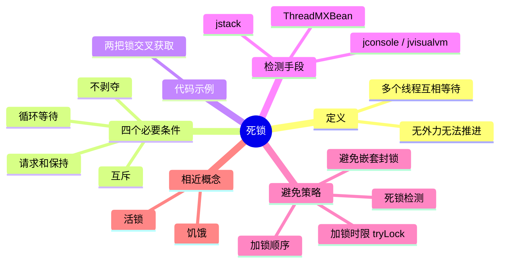

# 死锁



---

## 一、什么是死锁

死锁是指两个或两个以上的线程（进程）在执行过程中，因争夺资源而造成的一种**互相等待**的现象，若无外力作用，它们都将无法推进下去。

---

## 二、死锁产生的四个必要条件

1. **互斥条件**：进程要求对所分配的资源（如打印机）进行排他性控制，即在一段时间内某资源仅为一个进程所占有。此时若有其他进程请求该资源，则请求进程只能等待。
2. **不剥夺条件**：进程所获得的资源在未使用完毕之前，不能被其他进程强行夺走，即只能由获得该资源的进程自己来释放（只能是主动释放）。
3. **请求和保持条件**：进程已经保持了至少一个资源，但又提出了新的资源请求，而该资源已被其他进程占有，此时请求进程被阻塞，但对自己已获得的资源保持不放。
4. **循环等待条件**：存在一种进程资源的循环等待链，链中每一个进程已获得的资源同时被链中下一个进程所请求。即存在一个处于等待状态的进程集合 {P1, P2, ..., Pn}，其中 Pi 等待的资源被 P(i+1) 占有（i = 1, 2, ..., n-1），Pn 等待的资源被 P1 占有。

**要点**：四个条件必须**同时满足**才会发生死锁，破坏其中任意一个，死锁就无法形成——这是所有预防策略的出发点。其中互斥是资源本身的性质（如写锁天然排他），通常无法破坏，所以实际工作中主要从其余三个条件入手。

---

## 三、代码示例：亲手制造一个死锁

```java
public class DeadlockDemo {
    private static final Object LOCK_A = new Object();
    private static final Object LOCK_B = new Object();

    public static void main(String[] args) {
        new Thread(() -> {
            synchronized (LOCK_A) {
                System.out.println("线程1 持有 LOCK_A，等待 LOCK_B");
                sleep(100);
                synchronized (LOCK_B) {          // 等线程2 释放 LOCK_B
                    System.out.println("线程1 拿到 LOCK_B");
                }
            }
        }, "thread-1").start();

        new Thread(() -> {
            synchronized (LOCK_B) {
                System.out.println("线程2 持有 LOCK_B，等待 LOCK_A");
                sleep(100);
                synchronized (LOCK_A) {          // 等线程1 释放 LOCK_A
                    System.out.println("线程2 拿到 LOCK_A");
                }
            }
        }, "thread-2").start();
    }

    private static void sleep(long millis) {
        try {
            Thread.sleep(millis);
        } catch (InterruptedException e) {
            Thread.currentThread().interrupt();
        }
    }
}
```

线程1 持有 A 等 B，线程2 持有 B 等 A，构成循环等待——两个线程会**永久阻塞**，程序既不会结束也不会抛异常。

---

## 四、死锁的检测

1. **jstack <pid>**：最常用的手段，发现死锁时会直接打印 `Found one Java-level deadlock`，并列出涉及的线程、各自**持有的锁**和正在**等待的锁**，顺着输出就能定位到出问题的代码行。
2. **jconsole / jvisualvm**：JDK 自带图形化工具，连接进程后点"检测死锁"即可。
3. **ThreadMXBean**：代码内检测，适合线上监控报警：
   ```java
   ThreadMXBean bean = ManagementFactory.getThreadMXBean();
   long[] ids = bean.findDeadlockedThreads();   // 返回死锁线程 id，无死锁返回 null
   ```
4. **jcmd <pid> Thread.print**：与 jstack 等价的命令行工具；先用 `jps -l` 找到 pid。

---

## 五、如何避免死锁

### 1. 加锁顺序（线程按照一定的顺序加锁）

不同线程统一按同一个顺序申请锁，就破坏不了循环等待。比如**银行转账**场景：必须同时获得两个账户的锁才能操作，两个锁的申请发生了交叉。打破死锁闭环的办法就是——在涉及同时申请两个锁的方法中，**总是以相同的顺序申请锁**，比如总是先申请 id 大的账户上的锁，再申请 id 小的账户上的锁，这样就无法形成导致死锁的那个闭环。

### 2. 加锁时限（尝试获取锁时加上时限）

超过时限则放弃对该锁的请求，并**释放自己占有的锁**，从而破坏"不剥夺"条件。Java 中对应 `ReentrantLock.tryLock(long timeout, TimeUnit unit)`，拿不到就退回去、过一会儿重试。

### 3. 避免嵌套封锁

这是死锁最主要的成因：**如果你已经持有一个资源了，就要避免再去封锁另一个资源**。如果运行时只锁一个对象，几乎不可能出现死锁局面。

### 4. 死锁检测

无法完全避免时，用第四节的手段定期检测，及时暴露问题。

**补充**：还有经典的**银行家算法**（分配资源前先判断是否存在安全序列），理论上可以避免死锁，但需要预先知道每个进程的最大资源需求、开销大，实际工程中很少使用。

---

## 六、活锁与饥饿

| 概念 | 表现 | 与死锁的区别 |
| --- | --- | --- |
| 死锁 | 线程互相等待对方的资源，全部卡死 | 系统整体无法推进 |
| 活锁 | 线程没有被阻塞，但因为不断重试、互相谦让，始终无法向前推进 | 线程在"忙"，但做的是无用功；如两人在窄走廊同向让路、来回反复 |
| 饥饿 | 某个线程因资源总被其他线程抢走（优先级低、非公平锁插队），长时间得不到执行机会 | 系统整体仍在推进，只是某个线程被"饿死" |

活锁的典型破法：把重试的等待时间**随机化**，避免双方总是同步地做出相同退让。

---

## 七、30 秒口述版

死锁是多个线程互相持有对方想要的锁、形成循环等待。产生的四个必要条件是互斥、不剥夺、请求和保持、循环等待，**破坏任意一个即可预防**。实际最常用的是统一加锁顺序和 `tryLock` 超时；排查用 jstack / jconsole，会直接报 `Found one Java-level deadlock` 并列出持锁与等锁关系。注意与活锁（都在动但推进不了）、饥饿（系统在跑但某个线程拿不到资源）区分。
