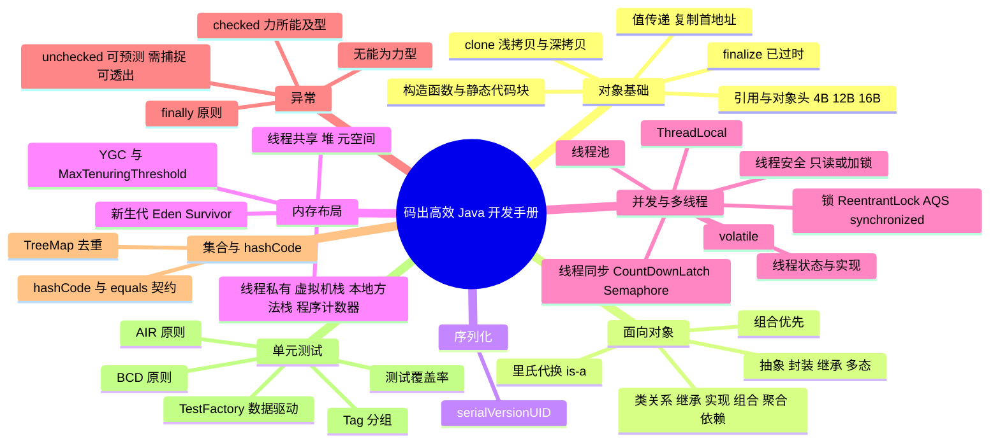

# 《码出高效：Java 开发手册》笔记

---

## 一、对象基础

### 1. clone()：浅拷贝、深拷贝与彻底深拷贝

- `clone()` 方法分为浅拷贝、一般深拷贝和彻底深拷贝。
- **浅拷贝**只复制当前对象的所有基本数据类型，以及相应的引用变量，但没有复制引用变量指向的实际对象。
- **彻底深拷贝**是在成功 clone 一个对象之后，此对象与母对象在任何引用路径上都不存在共享的实例对象；但是引用路径递归越深，则越接近母对象，且彻底深拷贝的实现难度越大。
- 介于浅拷贝和彻底深拷贝之间的都是**一般深拷贝**。
- 归根结底，慎用 `Object.clone()` 方法来拷贝对象，因为对象的 `clone()` 方法默认是浅拷贝；若想实现深拷贝，则需要覆写 `clone()` 方法，实现引用对象的深度遍历式拷贝。

### 2. finalize() 已过时

- `finalize()` 方法在 JDK 9 之后直接被标记为过时方法。
- 而 `wait()` 和 `notify()` 同步方式事实上已经被同步信号、锁、阻塞集合等取代。

### 3. 值传递

- 无论是对于基本数据类型，还是引用变量，Java 中的参数传递都是值复制的传递过程。
- 对于引用变量，复制的是指向对象的首地址，双方都可以通过自己的引用变量修改指向对象的相关属性。

### 4. 构造函数与静态代码块的执行顺序

- 在创建类对象时，会先执行父类和子类的静态代码块，然后再执行父类和子类的构造方法。并不是执行完父类的静态代码块和构造方法后，再去执行子类。
- 静态代码块只运行一次，在第二次对象实例化时不会运行。

### 5. 引用与对象头

- 作为一个引用变量，不管它是指向包装类、集合类、字符串类还是自定义类，引用变量 refvar 均占 4B 空间。注意它与真正对象 refobj 之间的区别。
- 无论 refobj 是多么小的对象，最小占用的存储空间是 12B（用于存储基本信息，称为对象头）；但由于存储空间分配必须是 8B 的倍数，所以初始分配的空间至少是 16B。

---

## 二、面向对象与类关系

### 1. 抽象、封装、继承、多态

- 设计模式七大原则之一的**迪米特法则**就是对于封装的具体要求，即模块使用另一个模块的某个接口行为时，对那个模块中除此行为之外的其他信息知道得尽可能少。

### 2. 继承与里氏代换原则

- 人人都说继承是 is-a 关系，那么如何衡量当前的继承关系是否满足 is-a 关系呢？判断标准即是否符合**里氏代换原则**（Liskov Substitution Principle, LSP）：任何父类能够出现的地方，子类都能够出现。
- 打个比方：警察在枪战片中经常说"放下武器，把手举起来！"而对面的匪徒们有的使用手枪，有的使用匕首，这些都是武器的子类。父类出现的地方即"放下武器"，那么放下手枪是对的，放下匕首也是对的。

### 3. 组合优先原则

- 谨慎使用继承，认清继承滥用的危害性，即**方法污染和方法爆炸**。
- 提倡**组合优先原则**来扩展类的能力，即优先采用组合或聚合的类关系来复用其他类的能力，而不是继承。

### 4. 五种类关系

| 类关系 | 关键字 / 形式 | 说明 |
| --- | --- | --- |
| 继承 | `extends`（is-a） | 子类复用父类的行为 |
| 实现 | `implements`（can do） | 类实现接口约定的能力 |
| 组合 | 类是成员变量（contain） | 完全绑定关系：所有成员共同完成一件使命，它们的生命周期是一样的。组合体现的是非常强的整体与部分的关系，同生共死，部分不能在整体之间共享 |
| 聚合 | 类是成员变量（has） | 一种可以拆分的整体与部分的关系，是非常松散的暂时组合，部分可以被拆出来给另一个整体 |
| 依赖 | `import`（use-a） | 除组合和聚合外的类与类之间的关系，这个类只要 import，那就是依赖关系 |

---

## 三、序列化

### 1. serialVersionUID 的兼容性处理

- 实现 `Serializable` 接口的类一定要显式地定义 `serialVersionUID` 属性值。修改类时需要根据兼容性决定是否修改 `serialVersionUID`：
  - 如果是**兼容升级**，请不要修改 `serialVersionUID` 字段，避免反序列化失败；
  - 如果是**不兼容升级**，需要修改 `serialVersionUID` 值，避免反序列化混乱。

---

## 四、内存布局

### 1. 线程私有

- **虚拟机栈**：描述 Java 方法执行的内存区域，它是线程私有的。栈中的元素用于支持虚拟机进行方法调用，每个方法从开始调用到执行完成的过程，就是栈帧从入栈到出栈的过程。在活动线程中，只有位于栈顶的帧才是有效的，称为当前栈帧；正在执行的方法称为当前方法，**栈帧是方法运行的基本结构**。
  - 栈帧包含：局部变量表、操作栈、动态链接、方法返回地址。
- **本地方法栈**
- **程序计数器**

### 2. 线程共享：堆与元空间

- 堆分成两大块：**新生代**和**老年代**。对象产生之初在新生代，步入暮年时进入老年代，但是老年代也接纳在新生代无法容纳的超大对象。
- 新生代 = Eden 区 + Survivor 区。绝大部分对象在 Eden 区生成，Eden 区装填满的时候，会触发 Young Garbage Collection（YGC）。
- 垃圾回收的时候，Eden 区实现清除策略，没有被引用的对象则直接回收；依然存活的对象会被移送到 Survivor，这个区真是名副其实的存在。
- Survivor 区分为 s0、s1 两块内存空间，送到哪块空间呢？每次 YGC 的时候，将存活的对象复制到未使用的那块空间，然后将当前正在使用的空间完全清除，交换两块空间的使用状态。
- 如果 YGC 要移送的对象大于 Survivor 区容量的上限，则直接移交给老年代。
- 假如一些"没有进取心"的对象以为可以一直在新生代的 Survivor 区交换来交换去，那就错了：每个对象都有一个计数器，每次 YGC 都会累加，`-XX:MaxTenuringThreshold` 参数能配置计数器的值，到达某个阈值的时候，对象从新生代晋升至老年代。
- 如果该参数配置为 0，那么从新生代的 Eden 区直接移至老年代；默认值 15，可以在 Survivor 区交换 14 次之后晋升至老年代。
- **元空间**（原方法区，JDK 8 起由元空间实现，使用本地内存）

---

## 五、并发与多线程

### 1. 线程与状态转换

- 状态转换：new、runnable、running、blocked、dead。
- 实现：Thread、Runnable、Callable、Future、FutureTask。

### 2. 线程安全的核心理念：要么只读，要么加锁

- 数据单线程可见：`ThreadLocal`；
- 数据只读：`String`、`Integer`；
- 线程安全类：`StringBuffer`；
- 同步与锁机制：
  - 线程同步类：`CountDownLatch`；
  - 并发集合类：`ConcurrentHashMap`；
  - 线程管理类：`Executors`；
  - 锁相关：`ReentrantLock`。

### 3. 锁：ReentrantLock、AQS 与 synchronized

**ReentrantLock 与 AQS**

- 并发包中锁类为 `Lock`。`ReentrantLock` 对于 `Lock` 接口的实现主要依赖了 `Sync`，`Sync` 继承了 `AbstractQueuedSynchronizer`（AQS），它是 JUC 包实现同步的工具。
- 在 AQS 定义了一个 `volatile int state` 变量作为共享资源：如果线程获取资源失败，则进入同步 FIFO 队列中等待；如果成功获取资源就执行临界区代码。执行完释放资源时，会通知同步队列中的等待线程来获取资源后出队并执行。
- AQS 是抽象类，内置自旋锁实现的同步队列，封装入队和出队的操作，提供独占、共享、中断等特性的方法。AQS 的子类可以定义不同的资源，实现不同性质的方法：
  - 比如可重入锁 `ReentrantLock`，定义 state 时可以获取资源并置为 1；若已获得资源，state 不断加 1，在释放资源时 state 减 1，直至为 0；
  - `CountDownLatch` 初始时定义了资源总量 state = count，`countDown()` 不断将 state 减 1，直到 state 为 0 时才能获得锁，释放后 state 一直为 0。

**同步代码块 synchronized**

- 原则是锁的范围尽可能小，锁的时间尽可能短，即能锁对象就不要锁类，能锁代码块就不要锁方法。
- JVM 底层是通过**监视锁**来实现 synchronized 同步的。监视锁（monitor）是每个对象与生俱来的一个隐藏字段。使用 synchronized 时，JVM 会根据 synchronized 的当前使用环境，找到对应对象的 monitor，再根据 monitor 的状态进行加、解锁的判断。

### 4. volatile

- 每个线程都有独占的内存区域，如操作栈、本地变量表等。线程本地内存保存了引用变量在堆内存中的副本，线程对变量的所有操作都在本地内存区域中进行，执行结束后再同步到堆内存中去。这里必然有一个时间差，在这个时间差内，该线程对副本的操作，对于其他线程都是不可见的。
- volatile 的英文本义是"挥发、不稳定的"，延伸意义为敏感的。当使用 volatile 修饰变量时，意味着任何对此变量的操作都会在内存中进行，不会产生副本，以保证共享变量的可见性，局部阻止了指令重排的发生。
- "**volatile 是轻量级的同步方式**"这种说法是错误的。它只是轻量级的线程操作可见方式，并非同步方式：如果是多写场景，一定会产生线程安全问题；如果是写少读多的并发场景，使用 volatile 修饰变量则非常合适。volatile 写少读多最典型的应用是 `CopyOnWriteArrayList`。

### 5. 线程同步工具

- **时间维度**：`CountDownLatch`
- **信号维度**：`Semaphore`

### 6. 线程池

- `ThreadPoolExecutor` 构造方法的 7 个参数。
- 典型线程池：JDK 8 增加 `Executors.newWorkStealingPool`。

### 7. ThreadLocal

- ThreadLocal 本质是在线程并发时解决变量共享问题，但由于过度设计（比如弱引用和哈希碰撞），导致理解难度大、使用成本高，反而成为故障高发点，容易出现内存泄漏、脏数据、共享对象更新等问题。
- 能不能构造这样一个对象：将这个对象设置为共享变量，统一设置初始值，但是每个线程对这个值的修改都是互相独立的？这个对象就是 ThreadLocal。注意不能将其翻译为"线程本地化"或"本地线程"，英语恰当的名称应该叫作 **CopyValueIntoEveryThread**。
- ThreadLocal 对象通常由 `private static` 修饰，因为都需要复制进入本地线程，所以非 static 作用不大。需要注意的是，**ThreadLocal 无法解决共享对象的更新问题**。
- 类图关系：
  - 1 个 `Thread` 有且仅有 1 个 `ThreadLocalMap` 对象；
  - 1 个 `Entry` 对象的 Key 弱引用指向 1 个 `ThreadLocal` 对象；
  - 1 个 `ThreadLocalMap` 对象存储多个 `Entry` 对象；
  - 1 个 `ThreadLocal` 对象可以被多个线程所共享；
  - `ThreadLocal` 对象不持有 Value，Value 由线程的 `Entry` 对象持有。
- 垃圾回收：当线程对象执行完毕时，线程对象内的实例属性均会被垃圾回收。源码中红色字标识 ThreadLocal 的弱引用：即使线程正在执行中，只要 ThreadLocal 对象引用被置成 null，Entry 的 Key 就会自动在下一次 YGC 时被垃圾回收；而在 ThreadLocal 使用 `set()`、`get()` 时，又会自动地将那些 key == null 的 Entry 的 value 置为 null，使 value 能够被垃圾回收，避免内存泄漏。
- 副作用：
  - 线程复用会产生脏数据，在 run 方法中要显式调用 `remove` 清理；
  - `static` 修饰后弱引用机制失效，要调用 `remove`。

---

## 六、异常

### 1. Error 与 Exception

- **Error**
- **Exception**

### 2. checked 异常

- **力所能及、坦然处置型**：如发生未授权异常 `UnAuthorizedException`，程序可跳转至权限申请页面。

### 3. unchecked 异常

unchecked 异常是运行时异常，它们都继承自 `RuntimeException`，不需要程序进行显式的捕捉和处理，可细分为三类：

1. **可预测异常（Predicted Exception）**：常见的可预测异常包括 `IndexOutOfBoundsException`、`NullPointerException`。基于对代码的性能和稳定性要求，此类异常不应该被产生或者抛出，而应该提前做好边界检查、空指针判断等处理。显式地声明或者捕获此类异常会对程序的可读性和运行效率产生很大影响。
2. **需捕捉异常（Caution Exception）**：例如在使用 Dubbo 框架进行 RPC 调用时产生的远程服务超时异常 `DubboTimeoutException`，此类异常是客户端必须显式处理的异常，不能因服务端的异常导致客户端不可用，此时处理方案可以是重试或者降级处理等。
3. **可透出异常（Ignored Exception）**：主要是指框架或系统产生的且会自行处理的异常，程序无须关心。例如针对 Spring 框架中抛出的 `NoSuchRequestHandlingMethodException` 异常，Spring 框架会自己完成异常的处理，默认将自身抛出的异常自动映射到合适的状态码，比如启动防护机制跳转到 404 页面。

### 4. 无能为力、引起注意型

- 针对此类异常，程序无法处理，如字段超长等导致 `SQLException`。即使做再多重试，对解决异常也没有任何帮助，一般处理此类异常的做法是**完整地保存异常现场**，供开发工程师介入解决。

### 5. finally 的使用原则

- finally 代码块的职责不在于对变量进行赋值等操作，而是**清理资源、释放连接、关闭管道流**等操作；此时如果有异常也要做 try-catch。
- 不要在 finally 赋值；
- 不要在 finally 中 return。

---

## 七、集合与 hashCode

### 1. 集合使用建议

- 集合初始化一定要指定大小容量，避免第一次使用就要扩展；
- 集合与数组转化时，`toArray()`、`asList()` 指定容量大小一致的效率最高；
- 常用：`HashMap`、`ConcurrentHashMap`。

### 2. hashCode 与 equals 的契约

- `Object.hashCode()` 生成哈希值。由于不可避免地会存在哈希值冲突的情况，因此 hashCode 相同时，还需要再调用 equals 进行一次值的比较；但是 hashCode 不同时，将直接判定对象不同，跳过 equals，这加快了冲突处理效率。
- 如果对象的 equals 的结果是相等的，两个对象的 hashCode 的返回值必须是相同的。
- 任何时候 equals 都必须同时覆写 hashCode。
- 对象作为 Map 的 key 或是 Set 的值，一定要覆写 equals 与 hashCode。

### 3. TreeMap 的去重

- `TreeMap` 依靠 `Comparable` / `Comparator` 来实现 Key 的去重。

---

## 八、单元测试

### 1. AIR 原则

- **A**：Automatic（自动化）
- **I**：Independent（独立性）
- **R**：Repeatable（可重复）

### 2. BCD 原则

- **B**：Border 边界值测试，包括循环边界、特殊取值、特殊时间点、数据顺序等；
- **C**：Correct 正确的输入，并得到预期的结果；
- **D**：Design 与设计文档相结合，来编写单元测试；
- **E**：Error 单元测试的目标是证明程序有错，而不是程序无错。为了发现代码中潜在的错误，我们需要在编写测试用例时有一些强制的错误输入（如非法数据、异常流程、非业务允许输入等）来得到预期的错误结果。

### 3. 测试覆盖率

- **粗粒度**：类、方法；
- **细粒度**：行覆盖、分支覆盖、条件判断覆盖、条件组合覆盖、路径覆盖。

### 4. 分组测试 @Tag

- "执行很快且很重要"的冒烟测试用例；
- "执行很慢但同样比较重要"的日常测试用例；
- "数量很多但不太重要"的回归测试用例。

### 5. 数据驱动测试 @TestFactory
