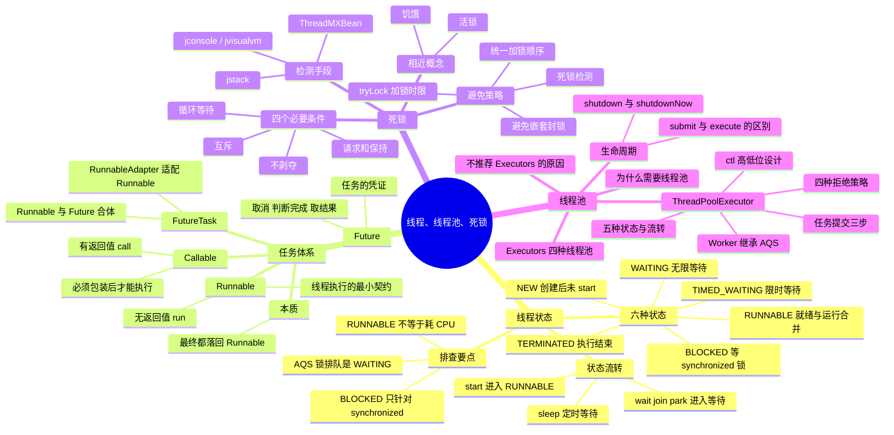

# 线程、线程池、死锁



---

## 一、线程的状态与流转

### 1. 六种状态

`java.lang.Thread` 内部用一个 State 枚举定义了线程的 6 种状态，可以通过 `thread.getState()` 获取，jstack 打出来的线程栈里也是这 6 种：

```java
public enum State {
    NEW, RUNNABLE, BLOCKED, WAITING, TIMED_WAITING, TERMINATED;
}
```

- **NEW**：线程对象已经创建，但还没有调用 `start()`。此时它只是一个普通的 Java 对象，还没有和操作系统线程关联。
- **RUNNABLE**：调用 `start()` 之后的状态。注意它是 JVM 层面的概念，把操作系统里的「就绪」和「运行中」合并在一起了——线程在等 CPU 时间片的时候，状态同样是 RUNNABLE。
- **BLOCKED**：等待 synchronized 的监视器锁时进入，抢到锁就回到 RUNNABLE。
- **WAITING**：无限期等待，必须靠其他线程显式唤醒。由 `Object.wait()`、`Thread.join()`、`LockSupport.park()` 进入。
- **TIMED_WAITING**：限时等待，时间到了自己会醒。由 `Thread.sleep(ms)`、`Object.wait(timeout)`、`Thread.join(timeout)`、`LockSupport.parkNanos()/parkUntil()` 进入。
- **TERMINATED**：`run()` 方法执行完毕（正常返回或者抛出异常）后进入。线程一旦终止就不能再启动，再次调用 `start()` 会抛 `IllegalThreadStateException`。

### 2. 状态流转图

```text
                            new Thread()
                                 │
                                 ▼
                               ┌─────┐
                               │ NEW │
                               └─────┘
                                 │ start()
                                 ▼
                          ┌────────────┐   run() 结束或抛异常   ┌────────────┐
                          │  RUNNABLE  │─────────────────────▶ │ TERMINATED │
                          └────────────┘                       └────────────┘
                             ▲     │
    抢到锁 / 被唤醒 / 超时了 ─┘     └─┬── 等 synchronized 锁 ──────────▶ BLOCKED
                                     ├── wait() / join() / park() ───▶ WAITING
                                     └── sleep(ms) / wait(ms) /
                                         join(ms) / parkNanos() ─────▶ TIMED_WAITING
```

BLOCKED、WAITING、TIMED_WAITING 这三个状态拿到锁或者被唤醒之后，都会回到 RUNNABLE。

### 3. 常用方法与状态变化

- `start()`：NEW → RUNNABLE，由 JVM 创建操作系统线程并回调 `run()`。直接调用 `run()` 只是普通的方法调用，不会开新线程，状态也不变。
- `Thread.sleep(ms)`：RUNNABLE → TIMED_WAITING，**不会释放已经持有的锁**。
- `Object.wait()` / `wait(ms)`：必须在 synchronized 块里调用，否则抛 `IllegalMonitorStateException`；调用时**会释放锁**，进入 WAITING / TIMED_WAITING。
- `Thread.join()` / `join(ms)`：在本线程里等待目标线程结束，本线程进入 WAITING / TIMED_WAITING（join 内部就是靠 wait 实现的）。
- `Object.notify()` / `notifyAll()`：唤醒在该对象监视器上等待的线程，被唤醒的线程先进入 BLOCKED 重新竞争锁，抢到之后才回到 RUNNABLE。
- `LockSupport.park()` / `unpark(thread)`：AQS 底层用的就是它。park 进入 WAITING，unpark 唤醒；和 wait/notify 不同，它不要求持有锁，也不抛 `InterruptedException`，被中断只是让 park 返回，需要自己检查中断标志。
- `Thread.yield()`：让出 CPU 给同优先级的线程，但线程仍然是 RUNNABLE。

### 4. 容易踩的坑

- **RUNNABLE 不等于「正在消耗 CPU」**。阻塞式 IO（比如读一个 socket）时，线程也一直显示 RUNNABLE，因为它不认为自己是在等锁或者等唤醒。所以线上看到一堆 RUNNABLE 的线程，还要结合 CPU 使用率一起判断。
- **BLOCKED 只针对 synchronized**。ReentrantLock 这类基于 AQS 的锁，排队时用的是 `LockSupport.park()`，线程状态是 WAITING / TIMED_WAITING，所以 jstack 里看不到 ReentrantLock 引起的 BLOCKED——排查死锁时要留意这两种完全不同的「卡住」形态。
- **wait 会释放锁，sleep 不会**；wait 必须在 synchronized 里调用，sleep 没有这个限制。
- BLOCKED、WAITING、TIMED_WAITING 都是被挂起的，**不占用 CPU**，这也是它们和自旋等待的区别。
- `interrupt()` 对处于等待态的线程会抛 `InterruptedException`（park 不抛，只是返回），对处于 BLOCKED 的线程不会让它退出阻塞——中断标志被设置，线程要等到抢到锁之后才有机会看到。

---

## 二、任务体系：Runnable、Callable、Future、FutureTask

### 1. Runnable

Runnable 应该是我们最熟悉的接口，它只有一个 `run()` 函数，用于将耗时操作写在其中，该函数**没有返回值**。然后使用某个线程去执行该 Runnable 即可实现多线程，Thread 类在调用 `start()` 函数后执行的就是 Runnable 的 `run()` 函数。Runnable 的声明如下：

```java
public interface Runnable {
/**
 * When an object implementing interface <code>Runnable</code> is used
 * to create a thread, starting the thread causes the object's
 * <code>run</code> method to be called in that separately executing
 * thread.
 * <p>
 *
 * @see     java.lang.Thread#run()
*/
  public abstract void run();
}
```

### 2. Callable

Callable 与 Runnable 的功能大致相似，Callable 中有一个 `call()` 函数，但是 `call()` 函数**有返回值**，而 Runnable 的 `run()` 函数不能将结果返回给客户程序。Callable 的声明如下：

```java
public interface Callable<V> {
/**
 * Computes a result, or throws an exception if unable to do so.
 *
 * @return computed result
 * @throws Exception if unable to compute a result
 */
V call() throws Exception;
}
```

可以看到，这是一个泛型接口，`call()` 函数返回的类型就是客户程序传递进来的 V 类型。

### 3. Future

Executor 就是 Runnable 和 Callable 的调度容器，Future 就是对于具体的 Runnable 或者 Callable 任务的执行结果进行**取消、查询是否完成、获取结果、设置结果**操作。`get` 方法会阻塞，直到任务返回结果。Future 声明如下：

```java
/**
* @see FutureTask
* @see Executor
* @since 1.5
* @author Doug Lea
* @param <V> The result type returned by this Future's <tt>get</tt> method
*/
public interface Future<V> {

  /**
   * Attempts to cancel execution of this task.  This attempt will
   * fail if the task has already completed, has already been cancelled,
   * or could not be cancelled for some other reason. If successful,
   * and this task has not started when <tt>cancel</tt> is called,
   * this task should never run.  If the task has already started,
   * then the <tt>mayInterruptIfRunning</tt> parameter determines
   * whether the thread executing this task should be interrupted in
   * an attempt to stop the task.     *
   */
  boolean cancel(boolean mayInterruptIfRunning);

  /**
   * Returns <tt>true</tt> if this task was cancelled before it completed
   * normally.
   */
  boolean isCancelled();

  /**
   * Returns <tt>true</tt> if this task completed.
   *
   */
  boolean isDone();

  /**
   * Waits if necessary for the computation to complete, and then
   * retrieves its result.
   *
   * @return the computed result
   */
  V get() throws InterruptedException, ExecutionException;

  /**
   * Waits if necessary for at most the given time for the computation
   * to complete, and then retrieves its result, if available.
   *
   * @param timeout the maximum time to wait
   * @param unit the time unit of the timeout argument
   * @return the computed result
   */
  V get(long timeout, TimeUnit unit)
      throws InterruptedException, ExecutionException, TimeoutException;
    }
```

### 4. FutureTask

FutureTask 则是一个 RunnableFuture，而 RunnableFuture 实现了 Runnable 又实现了 Future 这两个接口：

```java
public class FutureTask<V> implements RunnableFuture<V>
```

RunnableFuture：

```java
public interface RunnableFuture<V> extends Runnable, Future<V> {
/**
 * Sets this Future to the result of its computation
 * unless it has been cancelled.
 */
void run();
}
```

另外它还可以包装 Runnable 和 Callable，由构造函数注入依赖：

```java
public FutureTask(Callable<V> callable) {
    if (callable == null)
        throw new NullPointerException();
    this.callable = callable;
    this.state = NEW;       // ensure visibility of callable
}

public FutureTask(Runnable runnable, V result) {
    this.callable = Executors.callable(runnable, result);
    this.state = NEW;       // ensure visibility of callable
}
```

可以看到，Runnable 注入会被 `Executors.callable()` 函数转换为 Callable 类型，即 **FutureTask 最终都是执行 Callable 类型的任务**。该适配函数的实现如下：

```java
public static <T> Callable<T> callable(Runnable task, T result) {
    if (task == null)
        throw new NullPointerException();
    return new RunnableAdapter<T>(task, result);
}
```

RunnableAdapter 适配器：

```java
/**
 * A callable that runs given task and returns given result
 */
static final class RunnableAdapter<T> implements Callable<T> {
    final Runnable task;
    final T result;
    RunnableAdapter(Runnable task, T result) {
        this.task = task;
        this.result = result;
    }
    public T call() {
        task.run();
        return result;
    }
}
```

由于 FutureTask 实现了 Runnable，因此它既可以通过 Thread 包装来直接执行，也可以提交给 ExecutorService 来执行。并且还可以直接通过 `get()` 函数获取执行结果，该函数会阻塞，直到结果返回。因此 FutureTask 既是 Future、Runnable，又是包装了 Callable（如果是 Runnable 最终也会被转换为 Callable），它是这两者的合体。

### 5. 本质：最终都是 Runnable

线程这一层只认 Runnable，`start()` 之后 JVM 回调的入口一定是 `run()`。Callable、Future、FutureTask 都是在 Runnable 之上加出来的能力，最终还是要落回 Runnable 才能被执行：

- **Thread 本身就实现了 Runnable**：`public class Thread implements Runnable`，它内部持有构造时传入的 target，`start()` 由 JVM 创建新的操作系统线程，回来执行的还是 `Thread.run()`，而 `Thread.run()` 里只有一句 `target.run()`。
- **Callable 不是 Runnable**，它只是「有返回值的任务」这层抽象，自己无法直接被线程执行，必须适配：提交给线程池时会被 `Executors.callable()` 或 FutureTask 包装，FutureTask 里的 RunnableAdapter 就是把 Runnable 转成 Callable 的那层适配器。
- **FutureTask 实现了 RunnableFuture**，而 RunnableFuture 同时继承 Runnable 和 Future，所以它既能被 Thread 或线程池当成一个 Runnable 执行，又能通过 `get()` 拿结果。
- **线程池执行的任务同样必须是 Runnable**：`ThreadPoolExecutor.execute()` 只收 Runnable，`submit(Callable)` 内部是用 `newTaskFor(task)` 把 Callable 包成 FutureTask——还是 Runnable；连线程池里真正干活的工作线程 Worker 本身也实现了 Runnable。

```java
public class Thread implements Runnable {
    private Runnable target;

    @Override
    public void run() {
        if (target != null) {
            target.run();
        }
    }
}
```

### 6. 四个概念的分工

- **Runnable**：无返回值的任务，可以直接交给 Thread 或者线程池执行，是「可被线程执行」的最小契约。
- **Callable**：有返回值、能抛异常的任务，但必须先包装成 FutureTask 才能交给线程。
- **Future**：不是任务，是任务的「凭证」，用来取消、判断是否完成、获取结果。
- **FutureTask**：Runnable + Future 的合体，既能当任务执行，又能当凭证取结果。

### 7. 完整示例

```java
package com.effective.java.concurrent.task;

import java.util.concurrent.Callable;
import java.util.concurrent.ExecutionException;
import java.util.concurrent.ExecutorService;
import java.util.concurrent.Executors;
import java.util.concurrent.Future;
import java.util.concurrent.FutureTask;

/**
*
* @author mrsimple
*
*/
public class RunnableFutureTask {

/**
* ExecutorService
*/
static ExecutorService mExecutor = Executors.newSingleThreadExecutor();

/**
*
* @param args
*/
public static void main(String[] args) {
   runnableDemo();
   futureDemo();
}

/**
* runnable, 无返回值
*/
static void runnableDemo() {

   new Thread(new Runnable() {

       @Override
       public void run() {
           System.out.println("runnable demo : " + fibc(20));
       }
   }).start();
}

/**
* 其中Runnable实现的是void run()方法，无返回值；Callable实现的是 V
* call()方法，并且可以返回执行结果。其中Runnable可以提交给Thread来包装下
* ，直接启动一个线程来执行，而Callable则一般都是提交给ExecuteService来执行。
*/
static void futureDemo() {
   try {
       /**
        * 提交runnable则没有返回值, future没有数据
        */
       Future<?> result = mExecutor.submit(new Runnable() {

           @Override
           public void run() {
               fibc(20);
           }
       });

       System.out.println("future result from runnable : " + result.get());

       /**
        * 提交Callable, 有返回值, future中能够获取返回值
        */
       Future<Integer> result2 = mExecutor.submit(new Callable<Integer>() {
           @Override
           public Integer call() throws Exception {
               return fibc(20);
           }
       });

       System.out
               .println("future result from callable : " + result2.get());

       /**
        * FutureTask则是一个RunnableFuture<V>，即实现了Runnbale又实现了Futrue<V>这两个接口，
        * 另外它还可以包装Runnable(实际上会转换为Callable)和Callable
        * <V>，所以一般来讲是一个符合体了，它可以通过Thread包装来直接执行，也可以提交给ExecuteService来执行
        * ，并且还可以通过v get()返回执行结果，在线程体没有执行完成的时候，主线程一直阻塞等待，执行完则直接返回结果。
        */
       FutureTask<Integer> futureTask = new FutureTask<Integer>(
               new Callable<Integer>() {
                   @Override
                   public Integer call() throws Exception {
                       return fibc(20);
                   }
               });
       // 提交futureTask
       mExecutor.submit(futureTask) ;
       System.out.println("future result from futureTask : "
               + futureTask.get());

   } catch (InterruptedException e) {
       e.printStackTrace();
   } catch (ExecutionException e) {
       e.printStackTrace();
   }
}

/**
* 效率底下的斐波那契数列, 耗时的操作
*
* @param num
* @return
*/
static int fibc(int num) {
   if (num == 0) {
       return 0;
   }
   if (num == 1) {
       return 1;
   }
   return fibc(num - 1) + fibc(num - 2);
}

}
```

---

## 三、死锁

### 1. 什么是死锁

死锁是指两个或两个以上的线程（进程）在执行过程中，因争夺资源而造成的一种**互相等待**的现象，若无外力作用，它们都将无法推进下去。

线程的「卡住」有两种形态：等 synchronized 是 BLOCKED，等 AQS 系的锁（ReentrantLock 等）是 WAITING / TIMED_WAITING，排查时要能区分，详见[第一节](#一线程的状态与流转)。锁本身（synchronized、AQS、ReentrantLock）的原理见[《并发编程》](./并发编程.md#三锁)。

### 2. 死锁产生的四个必要条件

1. **互斥条件**：进程要求对所分配的资源（如打印机）进行排他性控制，即在一段时间内某资源仅为一个进程所占有。此时若有其他进程请求该资源，则请求进程只能等待。
2. **不剥夺条件**：进程所获得的资源在未使用完毕之前，不能被其他进程强行夺走，即只能由获得该资源的进程自己来释放（只能是主动释放）。
3. **请求和保持条件**：进程已经保持了至少一个资源，但又提出了新的资源请求，而该资源已被其他进程占有，此时请求进程被阻塞，但对自己已获得的资源保持不放。
4. **循环等待条件**：存在一种进程资源的循环等待链，链中每一个进程已获得的资源同时被链中下一个进程所请求。即存在一个处于等待状态的进程集合 {P1, P2, ..., Pn}，其中 Pi 等待的资源被 P(i+1) 占有（i = 1, 2, ..., n-1），Pn 等待的资源被 P1 占有。

**要点**：四个条件必须**同时满足**才会发生死锁，破坏其中任意一个，死锁就无法形成——这是所有预防策略的出发点。其中互斥是资源本身的性质（如写锁天然排他），通常无法破坏，所以实际工作中主要从其余三个条件入手。

### 3. 代码示例：亲手制造一个死锁

```java
public class DeadlockDemo {
    private static final Object LOCK_A = new Object();
    private static final Object LOCK_B = new Object();

    public static void main(String[] args) {
        new Thread(() -> {
            synchronized (LOCK_A) {
                System.out.println("线程1 持有 LOCK_A，等待 LOCK_B");
                sleep(100);
                synchronized (LOCK_B) {          // 等线程2 释放 LOCK_B
                    System.out.println("线程1 拿到 LOCK_B");
                }
            }
        }, "thread-1").start();

        new Thread(() -> {
            synchronized (LOCK_B) {
                System.out.println("线程2 持有 LOCK_B，等待 LOCK_A");
                sleep(100);
                synchronized (LOCK_A) {          // 等线程1 释放 LOCK_A
                    System.out.println("线程2 拿到 LOCK_A");
                }
            }
        }, "thread-2").start();
    }

    private static void sleep(long millis) {
        try {
            Thread.sleep(millis);
        } catch (InterruptedException e) {
            Thread.currentThread().interrupt();
        }
    }
}
```

线程1 持有 A 等 B，线程2 持有 B 等 A，构成循环等待——两个线程会**永久阻塞**，程序既不会结束也不会抛异常。

### 4. 死锁的检测

1. **jstack <pid>**：最常用的手段，发现死锁时会直接打印 `Found one Java-level deadlock`，并列出涉及的线程、各自**持有的锁**和正在**等待的锁**，顺着输出就能定位到出问题的代码行。
2. **jconsole / jvisualvm**：JDK 自带图形化工具，连接进程后点"检测死锁"即可。
3. **ThreadMXBean**：代码内检测，适合线上监控报警：
   ```java
   ThreadMXBean bean = ManagementFactory.getThreadMXBean();
   long[] ids = bean.findDeadlockedThreads();   // 返回死锁线程 id，无死锁返回 null
   ```
4. **jcmd <pid> Thread.print**：与 jstack 等价的命令行工具；先用 `jps -l` 找到 pid。

### 5. 如何避免死锁

#### （1）加锁顺序（线程按照一定的顺序加锁）

不同线程统一按同一个顺序申请锁，就破坏不了循环等待。比如**银行转账**场景：必须同时获得两个账户的锁才能操作，两个锁的申请发生了交叉。打破死锁闭环的办法就是——在涉及同时申请两个锁的方法中，**总是以相同的顺序申请锁**，比如总是先申请 id 大的账户上的锁，再申请 id 小的账户上的锁，这样就无法形成导致死锁的那个闭环。

#### （2）加锁时限（尝试获取锁时加上时限）

超过时限则放弃对该锁的请求，并**释放自己占有的锁**，从而破坏"不剥夺"条件。Java 中对应 `ReentrantLock.tryLock(long timeout, TimeUnit unit)`，拿不到就退回去、过一会儿重试。ReentrantLock 的可中断、超时能力见[《并发编程》](./并发编程.md#三锁)。

#### （3）避免嵌套封锁

这是死锁最主要的成因：**如果你已经持有一个资源了，就要避免再去封锁另一个资源**。如果运行时只锁一个对象，几乎不可能出现死锁局面。

#### （4）死锁检测

无法完全避免时，用第四节的手段定期检测，及时暴露问题。

**补充**：还有经典的**银行家算法**（分配资源前先判断是否存在安全序列），理论上可以避免死锁，但需要预先知道每个进程的最大资源需求、开销大，实际工程中很少使用。

### 6. 活锁与饥饿

| 概念 | 表现 | 与死锁的区别 |
| --- | --- | --- |
| 死锁 | 线程互相等待对方的资源，全部卡死 | 系统整体无法推进 |
| 活锁 | 线程没有被阻塞，但因为不断重试、互相谦让，始终无法向前推进 | 线程在"忙"，但做的是无用功；如两人在窄走廊同向让路、来回反复 |
| 饥饿 | 某个线程因资源总被其他线程抢走（优先级低、非公平锁插队），长时间得不到执行机会 | 系统整体仍在推进，只是某个线程被"饿死" |

活锁的典型破法：把重试的等待时间**随机化**，避免双方总是同步地做出相同退让。

---

## 四、线程池

### 1. 为什么需要线程池

好的软件设计不建议手动创建和销毁线程。线程的创建和销毁是非常耗 CPU 和内存的，因为这需要 JVM 和操作系统的参与。64 位 JVM 默认线程栈大小是 1 MB。这就是为什么说在请求频繁时为每个小的请求创建线程是一种资源的浪费。线程池可以根据创建时选择的策略自动处理线程的生命周期。重点在于：在资源（如内存、CPU）充足的情况下，线程池没有明显的优势，否则没有线程池将导致服务器崩溃。有很多的理由可以解释为什么没有更多的资源。例如，在拒绝服务（denial-of-service）攻击时会引起许多线程并行执行，从而导致线程饥饿（thread starvation）。除此之外，手动执行线程时，可能会因为异常导致线程死亡，程序员必须记得处理这种异常情况。

合理利用线程池能够带来三个好处。第一：降低资源消耗。通过重复利用已创建的线程降低线程创建和销毁造成的消耗。第二：提高响应速度。当任务到达时，任务可以不需要等到线程创建就能立即执行。第三：提高线程的可管理性。线程是稀缺资源，如果无限制的创建，不仅会消耗系统资源，还会降低系统的稳定性，使用线程池可以进行统一的分配，调优和监控。

### 2. Executor 框架与 Executors 工具类

Executor 框架同 java.util.concurrent.Executor 接口在 Java 5 中被引入。Executor 框架是一个根据一组执行策略调用，调度，执行和控制的异步任务的框架。Executor 存在的目的是提供一种将「任务提交」与「任务如何运行」分离开来的机制。定义如下：

```java
public interface Executor {
    void execute(Runnable command);
}
```

虽然只有一个方法，但是却为灵活且强大的异步任务执行框架提供了基础。它提供了一种标准的方法将任务的提交过程与执行过程解耦开来，并用 Runnable 来表示任务。那么我们怎么得到 Executor 对象呢？这就是接下来要介绍的 Executors 了。

Executors 为 Executor，ExecutorService，ScheduledExecutorService，ThreadFactory 和 Callable 类提供了一些工具方法，类似于集合中的 Collections 类的功能。Executors 方便的创建线程池。

### 3. Executors 提供的四种线程池

#### （1）newCachedThreadPool

该线程池比较适合没有固定大小并且比较快速就能完成的小任务，它将为每个任务创建一个线程。那这样子它与直接创建线程对象（new Thread()）有什么区别呢？看到它的第三个参数 60L 和第四个参数 TimeUnit.SECONDS 了吗？好处就在于 60 秒内能够重用已创建的线程。下面是 Executors 中的 newCachedThreadPool() 的源代码：

```java
public static ExecutorService newCachedThreadPool() {
    return new ThreadPoolExecutor(0, Integer.MAX_VALUE, 60L, TimeUnit.SECONDS, new SynchronousQueue<Runnable>());
}
```

#### （2）newFixedThreadPool

newFixedThreadPool 使用的 Thread 对象的数量是有限的，如果提交的任务数量大于限制的最大线程数，那么这些任务将排队，然后当有一个线程的任务结束之后，将会根据调度策略继续等待执行下一个任务。下面是 Executors 中的 newFixedThreadPool() 的源代码：

```java
public static ExecutorService newFixedThreadPool(int nThreads) {
    return new ThreadPoolExecutor(nThreads, nThreads, 0L, TimeUnit.MILLISECONDS, new LinkedBlockingQueue<Runnable>());
}
```

#### （3）newSingleThreadExecutor

newSingleThreadExecutor 就是线程数量为 1 的 FixedThreadPool，如果提交了多个任务，那么这些任务将会排队，每个任务都会在下一个任务开始之前运行结束，所有的任务将会使用相同的线程。下面是 Executors 中的 newSingleThreadExecutor() 的源代码：

```java
public static ExecutorService newSingleThreadExecutor() {
    return new FinalizableDelegatedExecutorService
        (new ThreadPoolExecutor(1, 1, 0L, TimeUnit.MILLISECONDS, new LinkedBlockingQueue<Runnable>()));
}
```

#### （4）newScheduledThreadPool

newScheduledThreadPool 创建一个固定长度的线程池，而且以延迟或定时的方式来执行任务。

#### （5）小结

通过如上配置的线程池的创建方法源代码，我们可以发现：

- 除了 CachedThreadPool 使用的是直接提交策略的缓冲队列以外，其余两个采用的都是无界缓冲队列，也就是说，FixedThreadPool 和 SingleThreadExecutor 创建的线程数量就不会超过 corePoolSize。
- 我们可以再来看看三个线程池采用的 ThreadPoolExecutor 构造方法都是同一个，使用的都是默认的 ThreadFactory 和 handler：

```java
private static final RejectedExecutionHandler defaultHandler = new AbortPolicy();

public ThreadPoolExecutor(int corePoolSize,
                     int maximumPoolSize,
                     long keepAliveTime,
                     TimeUnit unit,
                     BlockingQueue<Runnable> workQueue) {
    this(corePoolSize, maximumPoolSize, keepAliveTime, unit, workQueue,
        Executors.defaultThreadFactory(), defaultHandler);
}
```

也就是说三个线程池创建的线程对象都是同一个线程组、优先权等级为正常的 Thread.NORM_PRIORITY（5）的非守护线程，使用的被拒绝任务处理方式是直接抛出异常的 AbortPolicy 策略（见「任务提交与执行流程」一节的四种拒绝策略）。

### 4. 为什么不推荐使用 Executors

- newFixedThreadPool 和 newSingleThreadExecutor 使用无界队列 LinkedBlockingQueue（默认容量 Integer.MAX_VALUE），任务堆积时会一直往队列里放，最大堆内存耗尽后 OOM。
- newCachedThreadPool 和 newScheduledThreadPool 的最大线程数是 Integer.MAX_VALUE，会无限创建线程，线程过多同样会 OOM。
- 《阿里巴巴 Java 开发手册》要求线程池不允许使用 Executors 去创建，而是通过 ThreadPoolExecutor 的方式，让写的同学更加明确线程池的运行规则，规避资源耗尽的风险。

### 5. ExecutorService 任务周期管理接口

Executor 的实现通常都会创建线程来执行任务，但是使用异步方式来执行任务时，由于之前提交任务的状态不是立即可见的，所以如果要关闭应用程序时，就需要将受影响的任务状态反馈给应用程序。为了解决执行服务的生命周期问题，Executor 扩展了 ExecutorService 接口，添加了一些用于生命周期管理的方法。如下：

```java
public interface ExecutorService extends Executor {
    void shutdown();
    List<Runnable> shutdownNow();
    boolean isShutdown();
    boolean isTerminated();
    boolean awaitTermination(long timeout, TimeUnit unit) throws InterruptedException;
    // 省略部分方法
}
```

- shutdown()：平缓关闭，不再接受新任务，但会执行完已提交的任务（包括队列中排队的任务）。
- shutdownNow()：立即关闭，尝试中断正在执行的任务，并返回队列中尚未开始的任务列表。
- 两者都不会自动调用，线程池使用完必须手动关闭，否则核心线程会一直存活（除非设置了 allowCoreThreadTimeOut），导致 JVM 无法退出。

### 6. ThreadPoolExecutor 线程池实现类

先来看一下这个类中定义的重要变量，如下：

```java
private final BlockingQueue<Runnable> workQueue;              // 阻塞队列
private final ReentrantLock mainLock = new ReentrantLock();   // 互斥锁
private final HashSet<Worker> workers = new HashSet<Worker>();// 线程集合.一个Worker对应一个线程
private final Condition termination = mainLock.newCondition();// 终止条件
private int largestPoolSize;           // 线程池中线程数量曾经达到过的最大值。
private long completedTaskCount;       // 已完成任务数量
private volatile ThreadFactory threadFactory;     // ThreadFactory对象，用于创建线程。
private volatile RejectedExecutionHandler handler;// 拒绝策略的处理句柄
private volatile long keepAliveTime;   // 线程池维护线程所允许的空闲时间
private volatile boolean allowCoreThreadTimeOut;
private volatile int corePoolSize;     // 线程池维护线程的最小数量，哪怕是空闲的
private volatile int maximumPoolSize;  // 线程池维护的最大线程数量
```

其中需要特别说明的是：

- 线程池的运行状态和线程数量被压缩进一个 AtomicInteger 类型的 ctl 变量中：高 3 位保存运行状态（RUNNING、SHUTDOWN、STOP、TIDYING、TERMINATED），低 29 位保存有效线程数 workerCount。这样一次 CAS 就能同时判断状态和修改线程数。
- Worker 继承了 AQS 并实现了 Runnable，它既是一个可执行的任务，也是一把不可重入的独占锁。执行任务前加锁，执行完解锁，这样 shutdown 时可以通过 tryLock 判断线程是不是空闲的。AQS 的原理见[《并发编程》](./并发编程.md#三锁)。

### 7. 线程池状态与流转

线程池的运行状态就是 ctl 的高 3 位，一共 5 种：

```java
private static final int COUNT_BITS = Integer.SIZE - 3;   // 29
private static final int RUNNING    = -1 << COUNT_BITS;   // 111
private static final int SHUTDOWN   =  0 << COUNT_BITS;   // 000
private static final int STOP       =  1 << COUNT_BITS;   // 001
private static final int TIDYING    =  2 << COUNT_BITS;   // 010
private static final int TERMINATED =  3 << COUNT_BITS;   // 011
```

- RUNNING：能接受新任务，也会处理队列里已经排队的任务。线程池创建出来就是这个状态。它的二进制是 111，是 5 个状态里唯一的负数，所以源码中判断「是否还在运行」只用一句 `ctl < SHUTDOWN`。
- SHUTDOWN：不再接受新任务，但会把队列里已经排队的任务执行完。调用 shutdown() 后进入。
- STOP：不接受新任务，不再处理队列中排队的任务，同时中断正在执行的任务。调用 shutdownNow() 后进入。
- TIDYING：所有任务都已终止，工作线程数为 0，线程池即将结束。进入这个状态时会调用 terminated() 钩子方法（ThreadPoolExecutor 里是空实现，可以重写它来做资源回收），执行完成后进入 TERMINATED。
- TERMINATED：terminated() 执行完毕，线程池彻底结束。

状态流转是单向的，只能往前走，不能回退：

```text
                    shutdown()
      RUNNING ──────────────────▶ SHUTDOWN ─┐
         │                                  │  workerCount == 0
         │      shutdownNow()               ├──────────▶ TIDYING ──▶ TERMINATED
         └───────────────────▶ STOP ────────┘             （terminated() 执行完）
```

- RUNNING → SHUTDOWN：调用 shutdown()。
- RUNNING 或 SHUTDOWN → STOP：调用 shutdownNow()。
- SHUTDOWN → TIDYING：队列已空且工作线程数为 0。tryTerminate() 里会判断，只要队列还有排队任务就不会终止。
- STOP → TIDYING：工作线程数为 0，队列里没来得及执行的任务会被丢弃。
- TIDYING → TERMINATED：terminated() 执行完毕。

几个容易混淆的点：

- shutdown() 只中断空闲线程（interruptIdleWorkers）。判断线程是否空闲靠的是 Worker 那把锁——正在执行任务的 Worker 持有锁，tryLock 抢不到，就不会被中断，所以正在跑的任务能正常结束。
- shutdownNow() 中断所有线程，并把队列中尚未执行的任务取出、作为返回值交给调用者，队列随之清空，所以能更快走到 TIDYING。
- 无论哪种关闭，任务是否真的停下来都取决于任务自身是否响应中断（比如循环里检查 Thread.interrupted()），不响应中断的任务照样会跑完。
- 真正推动状态前进的是 tryTerminate()，它在线程退出、队列清空等所有「可能让线程池变空」的地方被调用。
- 对应的判断方法：isShutdown()（不是 RUNNING）、isTerminating()（已经是 STOP 以上，或者 SHUTDOWN 且队列非空）、isTerminated()（状态为 TERMINATED）。

### 8. 构造参数

```java
public ThreadPoolExecutor(int corePoolSize,
                          int maximumPoolSize,
                          long keepAliveTime,
                          TimeUnit unit,
                          BlockingQueue<Runnable> workQueue,
                          ThreadFactory threadFactory,
                          RejectedExecutionHandler handler)
```

- corePoolSize：核心线程数，即使空闲也会保留（除非开启 allowCoreThreadTimeOut）。
- maximumPoolSize：最大线程数，核心线程数 + 非核心线程数。
- keepAliveTime 与 unit：非核心线程空闲多久后被回收。
- workQueue：存放待执行任务的阻塞队列，常见的有：
    - ArrayBlockingQueue：基于数组的有界队列。
    - LinkedBlockingQueue：基于链表的队列，默认无界，吞吐高于 ArrayBlockingQueue。
    - SynchronousQueue：不存储元素的队列，每个插入操作必须等待另一个线程的移除操作，CachedThreadPool 用的就是它。
    - PriorityBlockingQueue：支持优先级排序的无界队列。
    - DelayQueue：使用优先级队列实现的无界延时队列。
- threadFactory：线程工厂，可以自定义线程名、优先级、是否为守护线程，方便排查问题。
- handler：拒绝策略，队列满且线程数达到 maximumPoolSize 时触发。

### 9. 任务提交与执行流程

execute() 方法的执行流程分三步：

1. 如果当前线程数小于 corePoolSize，直接创建核心线程执行任务（addWorker(command, true)）。
2. 否则把任务放入 workQueue：入队成功后要做一次二次检查——如果线程池已经关闭，就把刚入队的任务移除并拒绝；如果工作线程数为 0（线程都因超时被回收了），就补一个线程出来执行队列里的任务。
3. 如果入队失败（队列满了），就尝试创建非核心线程执行任务；如果也失败了（线程数已达 maximumPoolSize），就交给拒绝策略处理。

即：核心线程 → 队列 → 非核心线程 → 拒绝策略。这也解释了一个常见的疑惑：为什么队列满了才会去创建非核心线程，而使用无界队列时 maximumPoolSize 根本不会生效。

四种拒绝策略：

- AbortPolicy（默认）：直接抛出 RejectedExecutionException，调用者可以捕获并决定如何处理。
- CallerRunsPolicy：让提交任务的线程自己执行这个任务。它会拖慢提交速度，形成负反馈，从而给线程池争取处理时间，是一种温和的降级方案。
- DiscardPolicy：直接丢弃任务，不做任何通知。
- DiscardOldestPolicy：丢弃队列中最老的一个任务（也就是队头任务），再重新提交当前任务。

### 10. submit 与 execute 的区别

- execute() 只能提交 Runnable，没有返回值，任务抛出的异常会走到线程的 UncaughtExceptionHandler。
- submit() 可以提交 Runnable 和 Callable，返回 Future，任务抛出的异常会被封装进 Future，只有在调用 get() 时才以 ExecutionException 抛出。如果只 submit 不 get，异常就被静默吞掉了，排查问题时非常容易被坑。

---

## 五、30 秒口述版

线程状态只有 6 种，考点集中在三处：RUNNABLE 合并了就绪和运行，阻塞式 IO 时也显示 RUNNABLE；BLOCKED 只属于 synchronized，而 AQS 系锁排队表现为 WAITING/TIMED_WAITING，jstack 排查死锁时要能区分这两种「卡住」形态；wait 会释放锁、sleep 不会。任务抽象上，线程只认 Runnable——Callable 靠 FutureTask 适配后执行，Future 是取结果的凭证，FutureTask 是 Runnable 与 Future 的合体，线程池里真正干活的 Worker 本身也是一个 Runnable。

死锁是多个线程互相持有对方想要的锁、形成循环等待。产生的四个必要条件是互斥、不剥夺、请求和保持、循环等待，**破坏任意一个即可预防**。实际最常用的是统一加锁顺序和 `tryLock` 超时；排查用 jstack / jconsole，会直接报 `Found one Java-level deadlock` 并列出持锁与等锁关系。注意与活锁（都在动但推进不了）、饥饿（系统在跑但某个线程拿不到资源）区分。

线程池用 ctl 一个字段同时存状态和线程数，执行顺序是「核心线程 → 队列 → 非核心线程 → 拒绝策略」，生产环境应直接用 ThreadPoolExecutor 构造而不是 Executors。
