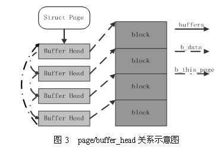
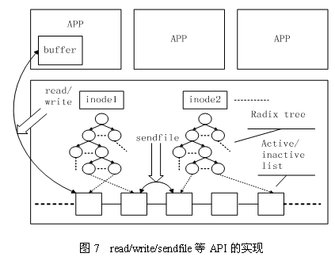

# Linux 内核的文件 Cache 管理机制介绍
在 Linux 操作系统中，当应用程序需要读取文件中的数据时，操作系统先分配一些内存，将数据从存储设备读入到这些内存中，然后再将数据分发给应用程序；当需要往文件中写数据时，操作系统先分配内存接收用户数据，然后再将数据从内存写到磁盘上。文件 Cache 管理指的就是对这些由操作系统分配，并用来存储文件数据的内存的管理。 Cache 管理的优劣通过两个指标衡量：一是 Cache 命中率，Cache 命中时数据可以直接从内存中获取，不再需要访问低速外设，因而可以显著提高性能；二是有效 Cache 的比率，有效 Cache 是指真正会被访问到的 Cache 项，如果有效 Cache 的比率偏低，则相当部分磁盘带宽会被浪费到读取无用 Cache 上，而且无用 Cache 会间接导致系统内存紧张，最后可能会严重影响性能。
## 文件 Cache 的地位和作用
从操作系统的角度考虑，文件 Cache 可以看做是内存管理系统与文件系统之间的联系纽带。图1描述了 Linux 操作系统中文件 Cache 管理与内存管理以及文件系统的关系示意图。从图中可以看到，在 Linux 中，具体文件系统，如 ext2/ext3、jfs、ntfs 等，负责在文件 Cache和存储设备之间交换数据，位于具体文件系统之上的虚拟文件系统VFS负责在应用程序和文件 Cache 之间通过 read/write 等接口交换数据，而内存管理系统负责文件 Cache 的分配和回收，同时虚拟内存管理系统(VMM)则允许应用程序和文件 Cache 之间通过 memory map的方式交换数据。

## 文件Cache相关数据结构
在 Linux 的实现中，文件 Cache 分为两个层面，一是 Page Cache，另一个 Buffer Cache，每一个 Page Cache 包含若干 Buffer Cache。
内存管理系统和 VFS 只与 Page Cache 交互，内存管理系统负责维护每项 Page Cache 的分配和回收，同时在使用 memory map （mmap）方式访问时负责建立映射；VFS 负责 Page Cache 与用户空间的数据交换。
文件系统则一般只与 Buffer Cache 交互，它们负责在外围存储设备和 Buffer Cache 之间交换数据。

 

 Page Cache 中被修改的内存称为“脏页”，内核通过 flush 线程定期将数据写入磁盘。
具体写入的条件我们可以通过 /proc/sys/vm 文件或者 sysctl -a | grep vm 命令得到。

// flush 每隔 5 秒执行一次
vm.dirty_writeback_centisecs = 500  
// 内存中驻留 30 秒以上的脏数据将由 flush 在下一次执行时写入磁盘
vm.dirty_expire_centisecs = 3000 
// 指示若脏页占总物理内存 10％以上，则触发 flush 把脏数据写回磁盘
vm.dirty_background_ratio = 10
// 系统所能拥有的最大脏页缓存的总大小
vm.dirty_ratio = 20

## 文件Cache相关API
Linux内核中与文件Cache操作相关的API有很多，按其使用方式可以分成两类：一类是以拷贝方式操作的相关接口， 如read/write/sendfile等，其中sendfile在2.6系列的内核中已经不再支持；另一类是以地址映射方式操作的相关接口，如mmap等。
* 第一种类型的API在不同文件的Cache之间或者Cache与应用程序所提供的用户空间buffer之间拷贝数据，其实现原理如图7所示。

 
* 第二种类型的API将Cache项映射到用户空间，使得应用程序可以像使用内存指针一样访问文件，Memory map访问Cache的方式在内核中是采用请求页面机制实现的，其工作过程如图8所示。

 首先，应用程序调用mmap（图中1），陷入到内核中后调用do_mmap_pgoff（图中2）。该函数从应用程序的地址空间中分配一段区域作为映射的内存地址，并使用一个VMA（vm_area_struct）结构代表该区域，之后就返回到应用程序（图中3）。当应用程序访问mmap所返回的地址指针时（图中4），由于虚实映射尚未建立，会触发缺页中断（图中5）。之后系统会调用缺页中断处理函数（图中6），在缺页中断处理函数中，内核通过相应区域的VMA结构判断出该区域属于文件映射，于是调用具体文件系统的接口读入相应的Page Cache项（图中7、8、9），并填写相应的虚实映射表。经过这些步骤之后，应用程序就可以正常访问相应的内存区域了。
### 普通文件的访问方式和mmap来访问文件两种的比较：
第一种：read/write/
通过read/write系统调访问，先在用户空间分配一段buffer，然后，进入内核，将内容从磁盘读取到内核缓冲，最后，拷贝到用户进程空间，至少牵扯到两次数据拷贝；同时，多个进程同时访问一个文件，每个进程都有一个副本，存在资源浪费的问题。

 
第二种：mmap
mmap()将文件直接映射到用户空间，这种方式只存在一次数据拷贝，效率更高。

* 减少系统调用。我们只需要一次 mmap() 系统调用，后续所有的调用像操作内存一样，而不会出现大量的 read/write 系统调用。
* 减少数据拷贝。普通的 read() 调用，数据需要经过两次拷贝；而 mmap 只需要从磁盘拷贝一次就可以了，并且由于做过内存映射，也不需要再拷贝回用户空间。
* 可靠性高。mmap 把数据写入页缓存后，跟缓存 I/O 的延迟写机制一样，可以依靠内核线程定期写回磁盘。