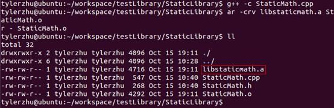
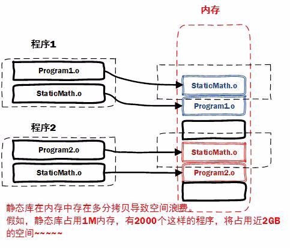
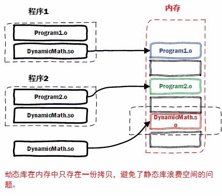
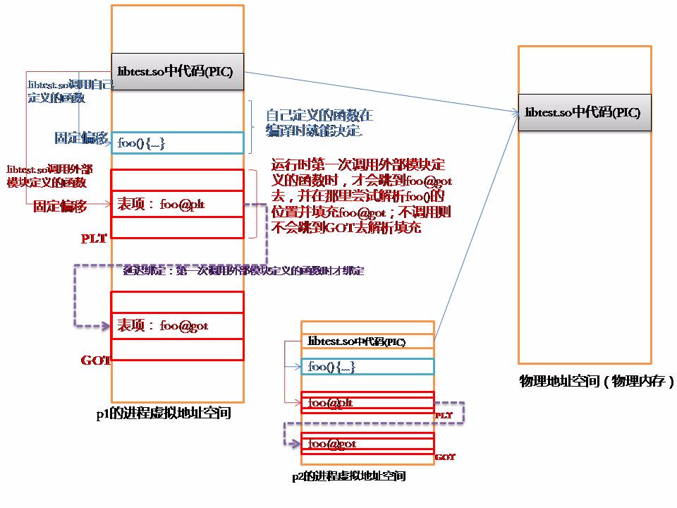

Linux下创建与使用静态库

Linux静态库命名规则
Linux静态库命名规范，必须是"lib[your_library_name].a"：lib为前缀，中间是静态库名，扩展名为.a。
创建静态库（.a）
通过上面的流程可以知道，Linux创建静态库过程如下：

* 首先，将代码文件编译成目标文件.o（StaticMath.o）

	g++ -c StaticMath.cpp
	
	注意带参数-c，否则直接编译为可执行文件

* 然后，通过ar工具将目标文件打包成.a静态库文件

	ar -crv libstaticmath.a StaticMath.o

生成静态库libstaticmath.a。

## 动态库
通过上面的介绍发现静态库，容易使用和理解，也达到了代码复用的目的，那为什么还需要动态库呢？
为什么还需要动态库？其实也是静态库的特点导致。

空间浪费是静态库的一个问题。

另一个问题是静态库对程序的更新、部署和发布页会带来麻烦。如果静态库liba.lib更新了，所以使用它的应用程序都需要重新编译、发布给用户（对于玩家来说，可能是一个很小的改动，却导致整个程序重新下载，全量更新）。

动态库在程序编译时并不会被连接到目标代码中，而是在程序运行是才被载入。不同的应用程序如果调用相同的库，那么在内存里只需要有一份该共享库的实例，规避了空间浪费问题。动态库在程序运行是才被载入，也解决了静态库对程序的更新、部署和发布页会带来麻烦。用户只需要更新动态库即可，增量更新。

动态库特点总结：

* 动态库把对一些库函数的链接载入推迟到程序运行的时期。
* 可以实现进程之间的资源共享。（因此动态库也称为共享库）
* 将一些程序升级变得简单。
* 甚至可以真正做到链接载入完全由程序员在程序代码中控制（显示调用）。

每个进程都需要拷贝DynamicMath.so吗？只是链接地址不同而已。
为了保证所有进程p1,p2,...都能共享libtest.so，需要将“数据”从“代码”中分离出去。

* 分离后“代码”部分是“地址无关代码(PIC)”。
* 分离后“数据部分”则有两种情形：(1)自己定义的；(2)引用外部模块定义的。

自己定义的不需用到GOT；而引用外部模块定义的需要用到GOT. GOT就是一个待填补的空，在重定位表中会有对应项说明GOT中每一个需要被填补的空缺，在外部模块被加载的时候会将这个空填上。

