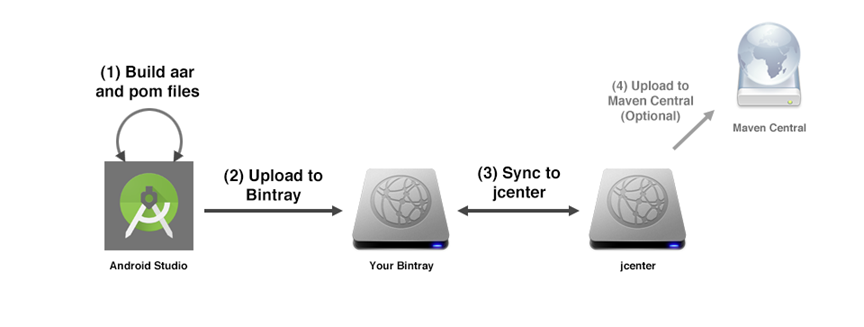
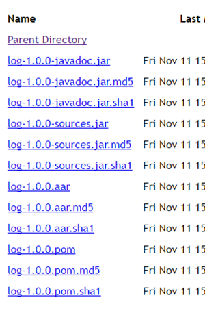
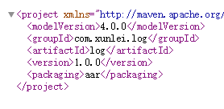
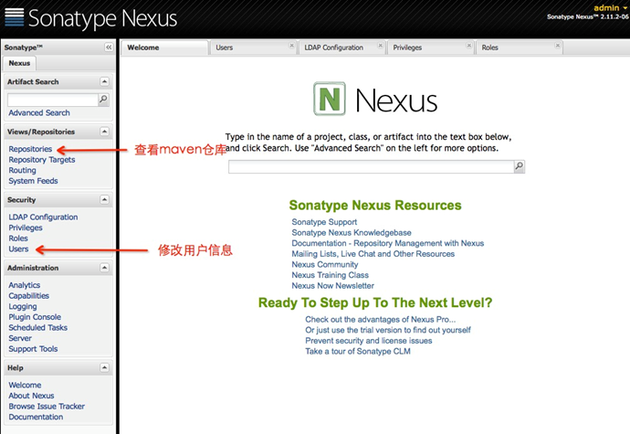

# Maven介绍

1.Maven是一个强大的Java项目构建工具。能帮助我们自动化构建过程，从清理，编译，测试到生成报告，再到打包和部署。

2.Maven 在我们项目中解决哪些问题：

* 输入命令就会帮我们自动 编译、运行单元测试、生成文档、打包和部署等。
* 我们在项目中会引入一些开源框架、第三方的工具等等，大都以jar包的形式出现，Maven可以对项目依赖的jar包进行管理。我们需要什么样的包，就到中央库mavenCentral去下载对应的jar。

3.发布到maven central的过程

## Maven 包（Package）
1.Maven 包是由所谓 POM（Project Object Model）所定义的文件包格式即可。

2.对于一个合符规范的 Maven Package，pom 文件、aar（或者 jar） 文件是必须的。而 javadoc 文件、源码文件、签名文件都不是必要的，但是某些公开仓库（如 mavenCentral ）有此要求。

## POM文件
* groupId
* artifactId
* version

三个元素定义了一个项目的基本坐标

Packaging 打包方式

dependency 依赖

## Sonatype Nexus私服安装与配置

* 1.jdk1.7
* 2.marven 解压，配置环境变量
* 3.nexus 解压
* 4.config文件中配置端口，ip,默认端口8081
* 5.运行命令 nexus install,nexus start,nexus stop
* 6. http://10.10.45.18:8081/nexus/默认账号密码为admin/admin123

## Nexus配置

## 项目中的组件化一般流程需要两个配置文件
1.maven_push.gradle文件

    apply plugin: 'maven'

    configurations {
        deployerJars
    }

    repositories {
        mavenCentral()
    }

    // 判断版本是Release or Snapshots
    def isReleaseBuild() {
        return !VERSION.contains("SNAPSHOT");
    }

    // 获取仓库url
    def getRepositoryUrl() {
        return isReleaseBuild() ? RELEASE_REPOSITORY_URL : SNAPSHOT_REPOSITORY_URL;
    }
    afterEvaluate { project ->
        uploadArchives {
            repositories {
                mavenDeployer {
                    pom.version = VERSION
                    pom.artifactId = ARTIFACT
                    pom.groupId = GROUP

                    repository(url: getRepositoryUrl()) {
                        authentication(userName: NAME, password: PASSWORD) // maven授权信息
     }
                }
            }

        }

        task androidSourcesJar(type: Jar) {
            classifier = 'sources'
     from android.sourceSets.main.java.sourceFiles
        }
        artifacts {
            archives androidSourcesJar
        }
    }

 

2.gradle.properties

	GROUP=com.xunlei.animation
	VERSION=1.0.4
	ARTIFACT=animation

	SNAPSHOT_REPOSITORY_URL=http://10.10.45.18:8081/nexus/content/repositories/snapshots/
	RELEASE_REPOSITORY_URL=http://10.10.45.18:8081/nexus/content/repositories/releases/

	NAME=admin
	PASSWORD=cy
 

## 使用

1.在需要的工程根目录下的build.gradle配置中，增加以下全局引用

	allprojects {
      	repositories {
      	jcenter()
     	maven {
       		url   "http://10.10.45.18:8081/nexus/content/repositories/releases/"
     		}
     	}     	
	}
	
2.在项目的主工程的build.grale中添加依赖

	dependencies { 
     	compile 'com.xunlei.animation:animation:1.0.0'
	}
 

 

