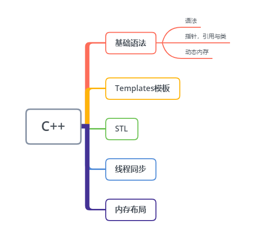

# Blog
以往的博客文章散落在csdn，简书，掘金等，现在归纳在这里
## Android
[组件化](https://github.com/chaoyueLin/componentDemo),[ceventbus](https://github.com/chaoyueLin/cevnetbus)

[插件化](https://github.com/chaoyueLin/pluginDemo)

[ASM](https://github.com/chaoyueLin/asmDemo)

[Gradle](https://github.com/chaoyueLin/GradleDemo)

[代码混淆](./Android/代码混淆/代码混淆.md),[ProGuard使用](./Android/代码混淆/ProGuard使用.md)

[UI优化](https://github.com/chaoyueLin/uiDemo),[View的绘制--Project Butter](./Android/View的绘制/View的绘制.md),[View绘制的顺序缓存](./Android/View绘制的顺序缓存/View绘制的顺序缓存.md)

[apktool](https://github.com/chaoyueLin/apktoolDemo)

[单元测试在Android](https://github.com/chaoyueLin/UnitTestInAndroid)，[infer代码检查](https://github.com/chaoyueLin/infer_code_check),[空指针异常](https://github.com/chaoyueLin/NPE_avoid)

[Jetpack使用](https://github.com/chaoyueLin/jetpackDemo),[webview](https://github.com/chaoyueLin/webviewDemo),[OKHttp与拦截链模式](https://github.com/chaoyueLin/okhttpDemo),[RxJava](https://github.com/chaoyueLin/reactive),[Retrofit](https://github.com/chaoyueLin/retrofitDemo),[Gson](./Android/Gson/Gson.md),[mmkv源码](https://github.com/chaoyueLin/mmkvDemo),[MMAP在Android中使用](./Android/MMAP在Android中使用/MMAP在Android中使用.md)

[深入理解Android虚拟机ART](./Android/深入理解Android虚拟机ART/README.md),[Java 虚拟机和Dalvik区别](./Android/Java虚拟机和Dalvik区别/Java虚拟机和Dalvik区别.md)

[SDK开发指南](./Android/SDK开发.md)

### 卡顿
[死锁检测](https://github.com/chaoyueLin/MonitorDemo),
[BlockCanary 源码分析](https://blog.csdn.net/Love667767/article/details/106302877),[WatchDog原理](https://juejin.cn/post/6844904015524954126),[卡顿、ANR、死锁，线上如何监控？](https://juejin.cn/post/6973564044351373326),[手Q Android线程死锁监控与自动化分析实践](https://cloud.tencent.com/developer/article/1064396),[Matrix-TraceCanary解析](https://blog.yorek.xyz/android/3rd-library/matrix-trace/)

[获取线程锁](https://github.com/chaoyueLin/MonitorDemo),[获取线程堆栈，cpu使用日志](https://github.com/chaoyueLin/threadDemo)

## Java

[类与对象](./Java/java_base1.md)

[集合](./Java/java_base2.md)

[多线程](./Java/java_base3.md),[死锁](./Java/死锁.md),[多线程协作](https://github.com/chaoyueLin/threadDemo)

[Java线程池实现原理及其在美团业务中的实践](https://tech.meituan.com/2020/04/02/java-pooling-pratice-in-meituan.html)

[静态代理和动态代理](./Java/代理.md)

[字符](./Java/java_base4.md)

[注解](https://github.com/chaoyueLin/annotationDemo)

## Kotlin
[Kotlin](https://github.com/chaoyueLin/kotlinDemo)

## C++

[C++写算法](./C++/C++写算法.md)

[C++基础](./C++/C++.md)

[static](./C++/static.md)

[函数](./C++/函数.md)

[类](./C++/类.mc)

[友元](./C++/友元.md)

[左值、右值与右值引用](./C++/左值、右值与右值引用.md)

### 与Java对比

### 视C++为一个语言联邦
C++是语言联邦，它综合了多种编程语言的特点，是多重范型编程语言（注意是范型，不是泛型），支持过程形式（procedural），面向对象形式（object-oriented），函数形式（functionnal），泛型形式（generic），元编程形式（meta programming）。

* C：说到底C++仍是以C为基础。区块，语句，预处理器，内置数据类型，数组，指针统统来自C。
* Object-Oreinted C++：这一部分是面向对象设计之古典守则在C++上的最直接实施。类，封装，继承，多态，virtual函数等等...
* Template C++：这是C++泛型编程部分。
* STL。STL是个template程序库：容器（containers），迭代器（iterators），算法（algorithms）以及函数对象（function objects）

### C++11的特性
C++11的特性主要包括下面几个方面：

* 提高运行效率的语言特性：右值引用、泛化常量表达式
* 原有语法的使用性增强：初始化列表、统一的初始化语法、类型推导、范围for循环、Lambda表达式、final和override、构造函数委托
* 语言能力的提升：空指针nullptr、default和delete、长整数、静态assert
* C++标准库的更新：智能指针、正则表达式、哈希表等

### 参考文章

[C++ Primer](https://github.com/applenob/Cpp_Primer_Practice),[Effective C++](https://blog.csdn.net/SiberiaBear/article/details/106414968),[Effective Modern C++](https://github.com/kelthuzadx/EffectiveModernCppChinese),[现代 C++ 教程：高速上手 C++ 11/14/17/20](https://changkun.de/modern-cpp/zh-cn/00-preface/)

## NDK
[NDK开发](https://github.com/chaoyueLin/ndkDemo),[cmake](https://github.com/chaoyueLin/cmakeDemo)

## Flutter
[Flutter](https://github.com/chaoyueLin/flutterDemo)

## Python
[Python](https://github.com/chaoyueLin/pythonDemo),[python在web开发](https://github.com/chaoyueLin/awesome-python-webapp)

## Lua
[lua基础](https://github.com/chaoyueLin/luaBaseDemo)

## 前端
[JavaScript原型链](https://github.com/chaoyueLin/JavaScriptDemo)

[Html5](https://github.com/chaoyueLin/JavaScriptDemo/blob/main/H5.md)

## Git
[git常用指令](./git常用指令.md)
## MySQL
[MySQL](https://github.com/chaoyueLin/MySQLDemo)

## 设计模式
[设计模式](./designPattern/designPattern.md),[单例,装饰,代理](./designPattern/单例,装饰,代理.md)
[控制反转](./designPattern/IoC.md),[有限状态机](https://github.com/chaoyueLin/stateDemo),[生产消费者](./designPattern/生产消费者.md)

[mvvm](https://github.com/chaoyueLin/mvvmDemo),[mvi](https://github.com/chaoyueLin/mviDemo)
## Linux
[UNIX环境高级编程](https://github.com/chaoyueLin/APUE_notes)

[Linux技术内幕](https://github.com/chaoyueLin/Linux_base)

[Linux性能优化](https://github.com/chaoyueLin/Linux)

# Base
[补码](./补码/补码.md)

[类图关系](./类图/class.md)

# 网络
[TCP](./TCP/TCP.md),[TLS](./TLS/TLS.md),[Http缓存原理](./Http缓存原理.md)

[Unix网络编程卷1](./Unix网络编程卷1/README.md)

## Other
[音视频基础知识](./音视频基础知识/音视频基础知识.md)

[Maven搭建与使用](./Maven搭建与使用/Maven搭建与使用.md)

[邮件app开发](https://github.com/chaoyueLin/emailDemo)