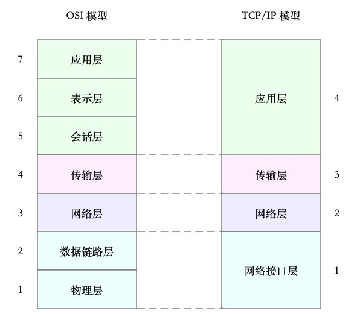
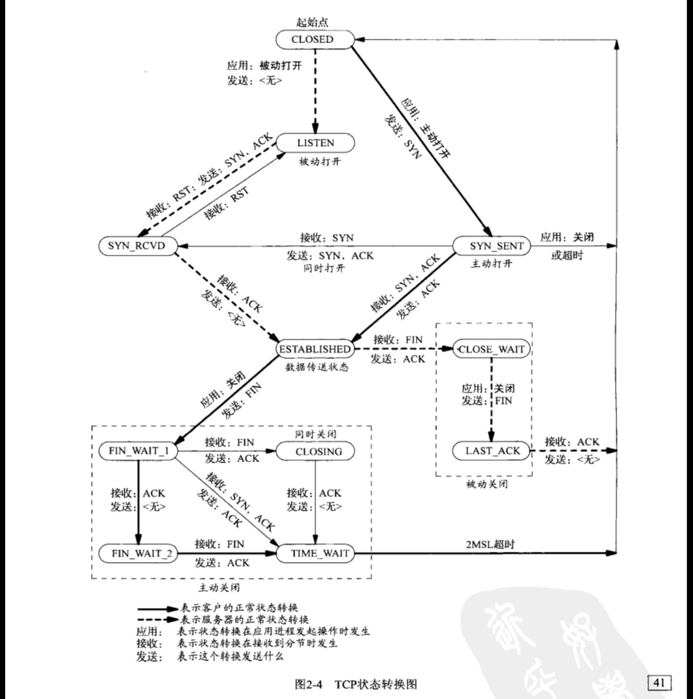
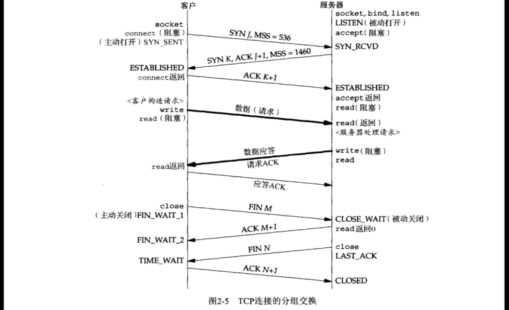
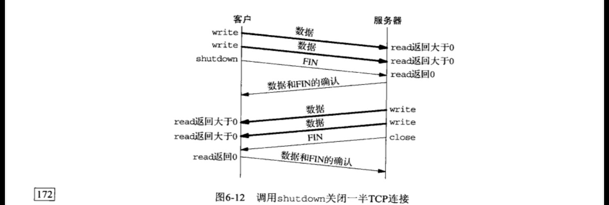

# TCP
## 网络分层

## TCP状态转换

## TIME WAIT 状态
亳无疑问，TCP中有关网络编程最不容易理解的是它的TIME WAIT状态。在图2-4中我们看到执行主动关闭的那端经历了这个状态。该端点停留在这个状态的持续时间是最长分节生命期（maximum segment lifetime, MSL）的两倍，有时候称之为2MSL。任何TCP实现都必须为MSL选择一个值。RFC 1122 \[Braden 1989〕的建议值是2分钟，过源自Berkeley的实现传统上改用30秒这个值。这意味着TIME\_ WAIT状态的持续时间在1分钟到4分钟之间。MSL是任何I数据报能够在因特网中存活的最长时间。我们知道这个时间是有限的，因为每个数据报含有- 个称为跳限 （hop limit）的8位字段（见图A-1中IPv4的TTL字段和图A-2中IPv6的跳限字段），它的最大值为255。尽管这是- 个跳数限制市不是真正的时间限制，我们仍然假设：具有最大跳限（255）的分组在网络中存在的时间不可能超过MSL秒。分组在网络中“迷途”通常是路由异常的结果。某个路由器崩溃或某两个路由器之间的某个链路断开时，路由协议需花数秒钟到数分钟的时间才能稳定并找出另一条通路。在这段时间内有可能发生路由循环 (路由器A把分组发送给路由器B，而B再把它们发送回A），我们关心的分组可能就此陷入这样的循环。假设迷途的分组是一个ICP分节，在它迷途期间，发送端TCP超时并重传该分组，而重传的分组却通过某条候选路径到达最终目的地。然而不久后（自迷途的分组开始其旅程起最多MSL秒以内）路由循环修复，早先迷失在这个循环中的分组最终也被送到目的地。这个原来的分组称为迷途的重复分组(lost duplicate）或漫游的重复分组 (wanderingduplicate ）。TCP必须正确处理这些重复的分组。

TIME WAIT状态有两个存在的理由：
1)可岸地实现TCP全双工连接的终止：
2）允许老的重复分节在网络中消逝，
第一理由可以通过查看图2-5并假设最终的ACK丢失了来解释。服务器将重新发送它的最终那个FIN，因此客户必须维护状态信息，以允许它重新发送最终那个ACK。要是客户不维护状态信息，它将响应以一个RST（另外一种类型的TCP分节），该分节将被服务器解释成- 个错
误。如果TCP打算执行所有必要的工作以彻底终止某个连接上两个方向的数据流（即全双工关闭），那么它必须正确处理连接终止序列4个分节中任何一个分节丢失的情况。本例子也说明了为什么执行主动关闭的那一端是处于TIME WAIT状态的那一端：因为可能不得不重传最终那个ACK的就是那一端。

为理解存在TIME WAIT状态的第二个理由，我们假设在12.106.32.254 的 1500端口和206.168.112.219的21端口之间有一个TCP连接。我们关闭这个连接，过一段时间后在相同的1P地址和端口之间建立另一个连接。后一个连接称为前一个连接的化身 (incarnation），因为它们的IP地址和端口号都相同。TCP必须防止来自某个连接的老的重复分组在该连接己终止后再现，从而被误解成属于同一连接的某个新的化身。为做到这一点，TCP将不给处于TIME\_ WAIT状态的连接发起新的化身。既然TIME\_WAIT状态的持续时间是MSL的2倍，这就足以让某个方向上的分组最多存活MSL秒即被丢弃，另-一个方向上的应答最名存活MSL秒也被丢弃。通过实施这个规则，我们就能保证每成功建立一个TCP连接时，来自该连接先前化身的老的重复分组都已在网络中消逝了。

## shutdown函数
终止网络连接的通常方法是调用close函数。不过c1ose有两个限制，却可以使用shutdown来避免。
(1)close把描述符的引用计数减1，仅在该计数变为0时才关闭套接字。我们已在4.8节讨论过这一点。使用shutdown可以不管引用计数就激发TCP的正常连接终止序列（图2-5中由FIN开始的4个分节）。
(2)close终止读和写两个方向的数据传送。既然TCP连接是全双工的，有时候我们需要告知对端我们己经完成了数据发送，即使对端仍有数据要发送给我们。这就是我们在前一节中遇到的str\_c1i西数在批量输入时的情况。图6-12展示了这样的情况下典型的函数调用。  

	#include <sys/socket.h>
	int shutdown (int sockfa, int howto):
	返回：若成功则为0，若出错则为-1

该两数的行为依赖于howto参数的值。
SHUT\_RD 关闭连接的读这一半-套接字中不再有数据可接收，而且套接字接收缓冲区中的现有数据都被丢弃。进程不能再对这样的套接字调用任何读函数。对一个TCP套接字这样调用shutdown函数后，由该套接字接收的来自对端的任何数据都被确认，然后俏然丢弃。默认情形下，写入一个路由套校宇（第18章）中的所有数据都被作为同一个主机上所有路由套接宇的可能输入环回。有些程序把第二个参数指定为SHUT\_RD来调用shutdown西数以防止环回复制。防止环回复制的另一种方法是关闭SO USELOOPBACK套接字选项。SHUT WR关闭连接的写这一半-对于TCP套接字，这称为半关闭(half-close，见TCPvI的18.5节)。当前留在套接宇发送缓冲区中的数据将被发送掉，后跟TCP的正常连接终止序列。我们已经说过，不管套接字描述符的引用计数是否等于0，这样的写半部关闭照样执行。进程不能再对这样的套接字调用任何写函数

带外数据

许多传输层有带外数据 (out-ofband data）的概念，它有时也称为经加速数据 (expedited data）。其想法是一个连接的某端发生了重要的事情，而且该端希望迅速通告其对端。这里“迅速〞意味着这种通知应该在己经排队等待发送的任何 “普通”（有时称为“带内”）数据之前发送。也就是说，带外数据被认为具有比普通数据更高的优先级。带外数据并不要求在客户和服务器之间再使用一个连接，而是被映射到己有的连接中。不幸的是，一旦超越普通概念光临现实世界，我们发现几乎每个传输层都各自有不同的带外数据实现。而UDP作为一个极端的例子，没有实现带外数据。

TCP并没有真正的带外数据，不过提供了我们接着讲解的紧急模式（urgent mode )。假设一个个进程已经往一个TCP套接字写出N字节数据，而且TCP把这些数据排队在该套接字的发送缓冲区中，等着发送到对端。图24-1展示了这样的套接字发送缓冲区，并且标记了从1到N的数据字节

该进程接着以MSG\_ O0B标志调用sena西数写出一个含有ASCII字符a的单字节带外数据：

	send(fd, a", 1, MSG.OOB);

TCP把这个数据放置在该套接字发送缓冲区的下一个可用位置，并把该连接的TCP紧急指针 (urgentpointer）设置成再下一个可用位置。图24-2展示了此时的套接字发送缓冲区，并且把带外字节标记为"OOB",

给定如图24-2所示的TCP套接字发送缓冲区状态，发送端TCP将为待发送的下一个分节在TCP首部中设置URG标志，并把紧急偏移 (urgent offset）字段设置为指向带外字节之后的字节，不过该分节可能含也可能不含我们标记为OOB的那个字节。0OB字节是否发送取决于在套接字发送缓冲区中先于它的字节数、TCP准备发送给对端的分节大小以及对端通告的当前窗口。

这是TCP紧急模式的一个重要特点：ICP首部指出发送端己经进入紧急模式（即伴随紧急偏移的URG标志已经设置），但是由紧急指针所指的实际数据字节却不一定随同送出。事实上即使发送端TCP因流量控制而哲停发送数据（接收端的套接字接收缓冲区己满，导致其TCP向发送端TCP通告了一个值为0的窗口），紧急通知照样不伴随任何数据地发送(TCPv2第1016页～1017页），就像我们将在图24-10和图24-11看到的那样。这也是应用进程使用TCP紧急模式（即带外数据）的一个原因：即便数据的流动会因为TCP的流量控制而停止，紧急通知却总是无障碍地发送到对端TCP。

如果我们发送多字节的带外数据，情况又会如何呢？例如：

	sena(fd, "abc", 3, MSG\_0OB);

在这个例子中，TCP的紧急指针指向最后那个字节紧后的位置，也就是说最后那个字节（字母c）被认为是带外字节。至此我们已经讲述了带外数据的发送，下面从接收端的角度查看一下。当收到一个设置了URG标志的分节时，接收端TCP检查紧急指针，确定它是否指向新的带外数据，也就是判断本分节是不是首个到达的引用从发送端到接收端的数据流中特定字节的紧急模式分节。发送端TCP往往发送多个含有URG标志且紧急指针指向同一个数据字节的分节(通常是在一小段时间内）。这些分节中只有第一个到达的会导致通知接收进程有新的带外数据到达。

(2）当有新的紧急指针到达时，接收进程被通知到。首先，内核给接收套接字的属主进程发送SIGURG信号，前提是接收进程（或其他进程）曾调用fcnt1或ioct1为这个套接字建立了屈主（图7-20），而且该属主进程己为这个信号建立了信号处理两数。其次，如果接收进程阻塞在select调用中以等待这个套接字描述符出现一个异常条件，select调用就返回。一旦有新的紧急指针到达，不论由紧急指针指向的实际数据字节是否己经到达接收端TCP，这两个潜在通知接收进程的手段就发生动作。只有一个00B标记，如果新的OOB字节在旧的OOB字节被读取之前就到达，旧的OOB字节会被丢弃

3）当由紧急指针指向的实际数据字节到达接收端TCP时，该数据字节既可能被拉出带外，也可能被留在带内，即在线(inline）留存。S_OOBINLINE套接字选项默认情况下是禁止的对于这样的接收端套接宇，该数据字节并不放入套接字接收缓冲区，而是被放入该连接的一个独立的单字节带外缓冲区(TCPv2第986\~988页）。接收进程从这个单字节缓冲区读入数据的唯一方法是指定MSG\_OOB标志调用recv、recvErom或recvmsg。如果新的OOB字节在旧的O0B字节被读取之前就到达，旧的OOB字节会被丢弃。然而如果接收进程开启了SO\_OOBINLINE套接字选项，那么由TCP紧急指针指向的实际数据宇节将被留在通常的套接字接收缓冲区中。这种情况下，接收进程不能指定MSG\_o0B标志读入该数据字节。相反，按收进程通过检查该连接的带外标记 (out-of-band mark）以获悉何时访问到这个数据字节