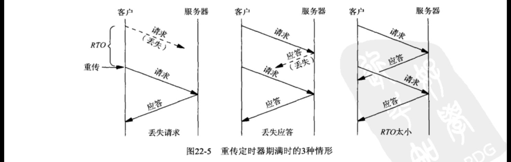

# UDP
我们首先列举UDP的优势。

* 正如图20-1所示，UDP支持广播和多播。事实上如果应用程序使用广播或多播，那就必
须使用UDP。我们己在第20章和第21章讨论过这两种寻址模式。
* UDP没有连接建立和拆除。相对于图2-5，UDP只需要两个分组就能交换一个请求和一个应答（假设两者的长度都小于两个端系统之间的最小MTU)。TCP却需要大约20个分组，这里假设为每次请求-应答交换建立一个新的TCP连接，
获得应答所需的分组往返次数在这种分组数目分析中也很重要。正奶TCPV3附录A所述，从请求到应答的分组往返次数在延迟超过带宽情形下变得非常重要。那段文字表明，就单个UDP请求-应答交换而言的最小事务处理时问(transaction time ）为RTT+SPT,其中RTT表示客户与服务器之间的往返时间(round-trip time)，SPT则表示客户请求的服务器处理时间 (server processing time ）。然而就TCP而言，如果同样的请求-应答交换用到•
一个新的TCP连接，那么最小事务处理时间将是2×RTT+SFT，比UDP时间多-个RTT.

关于第二点我们应该清楚：如果单个ICP连接用于多个请求-应答交换，那么连接的建立和拆除开销就由所有的请求和应答分担，这样的设计通常比为每个请求-应答交换使用新连接要好。尽管如此，有些应用系统还是为每个请求-应答交换使用一个新的TCP连接（臂如较早版本的HTTP），而有些应用系统则在客户和服务器交换一个请求-应答后，可能数小时或数天不再通信（譬如DNS)。

我们接着列出UDP无法提供的TCP特性，这意味着如果这些特性对于具体应用系统是必需的，那么其应用程序必须自行提供它们。需注意的是，不是所有应用程序都需要TCP的所有这些特性。举例来说，对于实时音频应用程序而言，如果接收进程能够通过插值弥补遗失数据那么丢失的分节也许不必重传。同样，对于简单的请求-应答事务处理而言，如果两端事先协定最大的请求和应答大小，那么也许不需要窗口式流量控制。

* 正面确认，丢失分组重传，重复分组检测，给被网络打乱次序的分组排序。TCP确认所有数据，以便检测出丢失的分组。这些特性的实现要求每个TCP数据分节都包含一个能被对端确认的序列号。这些特性还要求TCP为每个连接估算重传超时值，该值应随着两个端系统之间分组流通的变化持续更新。
* 窗口式流量控制。接收端TCP告知发送端自己己为接收数据分配了多大的缓冲区空间，发送端不能发送超过这个大小的数据。也就是说，发送端的末确认数据量不能超过接收端告知的窗口。
* 慢启动和拥塞避免。这是由发送端实施的一种流量控制形式，它通过检测当前的网络容量来应对阵发的拥塞。当前所有的TCP必须支持这两个特性，而且我们根据20世纪80年代后期这些算法实现之前的经验知道，那些面临拥塞而不“后退” (back off）的协议只会导致拥塞变得更糟糕（例如\[Jacobson 1988\])。

作为总结，我们可以陈述如下建议。对于广播或多播应用程序必须使用UDP。任何形式的错误控制必须加到客户和服务器程序之中，不过应用系统往往是在可以接受一定量（假设是少量）的错误的前提下（例如音频或视频的分组丢失）使用广播和多播。要求可靠递送的多播应用系统（例如多播文件传输）确非没有，不过我们必须衡量使用多播的性能收益（发送单个分组到N个目的地，对比跨N个TCP连接发送该分组的N个副本〉是否权重于为提供可靠通信而要求增添到应用程序中的复杂性。

对于简单的请求-应答应用程序可以使用UDP，不过错误检测功能必须加到应用程序内部。错误检测至少涉及确认、超时和重传。流量控制对于合理大小的请求和应答往往不成问题。我们将在22.5节给出的UDP应用程序中提供这些特性的一个例子。这里需要考虑的因素包括客户和服务器通信的频度(可否在相继的通信之间保持所用的TCP连接？）
以及所交换的数据量（如果通常需要多个分组，那么TCP连接的建立和拆除开销将变得不大重要）。

对于海量数据传输（例如文件传输）不应该使用UDP。因为这么做除了上一点要求的特性外，还要求把窗口式流量控制、拥塞避免和慢启动这些特性也加到应用程序中，意味着我们是在应用程序中再造TCP。我们应该让厂商来关注更好的TCP性能，而自己应该致力于提升应用程序本身。

UDP 应用增加可靠性正如上一节所提，如果想要让请求-应答式应用程序使用UDP，那么必须在客户程序中增加
以下两个特性。

* (1)超时和重传：用于处理丢失的数据报。
* (2)序列号：供客户验证-一个应答是否匹配相应的请求。  

增加序列号比较简单。客户为每个请求冠以一个序列号，服务器必须在返送给客户的应答中回射这个序列号。这样客户就可以验证某个给定的应答是否匹配早先发出的请求。处理超时和重传的老式方法是先发送一个请求并等待N秒钟。如果期间没有收到应答，那就重新发送同一个请求并再等待N秒钟。如此发生一定次数后放弃发送。这是线性重传定时器的一个例子。(TCPv1的图6-8给出了使用这个技巧的TFTP客户程序的一个例子。许多TFTP客户
程序仍使用这个方法。）

这个方法的问题在于数据报在网络上的往返时间可以从局域网的远不到一秒钟变化到广域网的好几秒钟。影响往返时间（RTT）的因素包括距离、网络速度和拥塞。另外，客户和服务器之间的RTT会因网络条件的变化而随着时间迅速变化。我们必须采用一个把实测到的RTT及其随时间的变化考虑在内的超时和重传算法。这个领域己有不少研究工作，大多数涉及TCP,不过同样的想法适用于任何网络应用。  

我们想要计算用于发送每个分组的重传超时 (retransmission timcout, RTO)。为此先测量
每个分组的实际往返时间RTT。每测得
一个RTT， 我们就更新2个统计估算因子：srtt是平滑化RTT
估算因子（smoothed RTT estimator)，riovar是平滑化平均偏差估算因子 (smoothed mean deviation
estimator)。后者只是标准偏差的一个较好近似，不过由于不涉及开方而易于计算。有了这2个
估算因子，待用的RTO就是srt加上4倍ritvar。\[Jacobson 1988〕 给出了这些计算的所有细节，我
们可以用以下4个方程式加以总结。

	delta = WARTT-srtt
	srit + srit + g X delta
	ritvar a rttvar + h (delta) - rttvar)
	RTO = srit + 4 X ritvar

delta是测得RTT和当前平滑化RTT估算因子（srt）之差。g是施加在RTT估算因子上的增益，
值为1/8。h是施加在平均偏差估算因子上的增益，值为1/4。  

[Jacobson 1988〕指出的另一点是：当重传定时器期满时，必须对下一个RTO应用某个指数回退 （exponential backoff)。举例来说，如果第一个RTO是2秒，期间未收到应答，那么下
一个RTO是4秒。如果仍未收到应答，那么再下一个RTO是8秒、16秒，依次类推。

Jacobson的算法告诉我们每次测得一个RTT后如何计算RTO以及重传时如何增加RTO。然而当我们不得不重传
一个分组并随后收到一个应答时，称为“重传二义性问题”(retransmissionambiguity problem）的新问题出现了。图22-5展示了重传定时器期满时可能出现的如下了种情形：

* 请求丢失了；
* 应答丢失了；
* RTO太小  

Karn的算法 \[Karn and Partridge 1987\] 可以解决重传二义性问题，即一旦收到重传过的某
个请求的一个应答，就应用以下规则。

* 即使测得一个RTT，也不用它更新估算因子，因为我们不知道其中的应答对应哪次重传
的请求。
* 既然应答在重传定时器期满前到达，(可能指数回退过的）当前RTO将继续用于下一个分
组。只有当我们收到未重传过的某个请求的一个应答时，我们才更新RTT估算因子并重
新计算RTO。