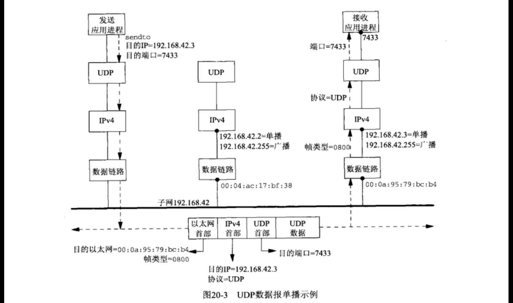
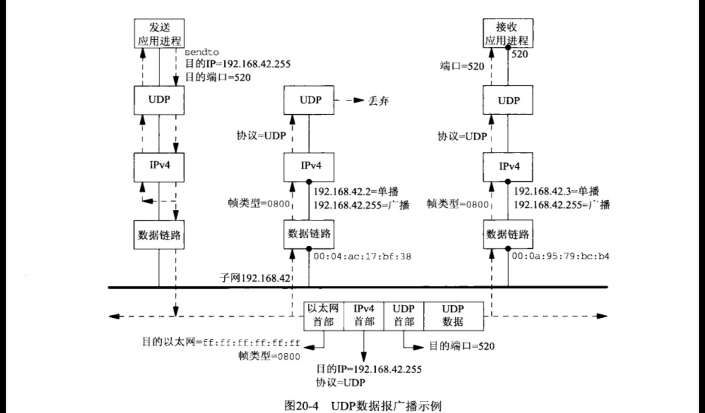

# 广播多播

广播的用途之一是在本地子网定位一个服务器主机，前提是已知或认定这个服务器主机位于本地子网，但是不知道它的单播IP地址。这种操作也称为资源发现(resource discovery )。另一个用途是在有多个客户主机与单个服务器主机通信的局域网环境中尽量减少分组流通。出于这个目的使用广播的因特网应用有多个例子。

* ARP (Address Resolution Protocol，地址解析协议）。ARP并不是一个用户应用，而是IPv4的基本组成部分之一。ARP在本地子网上广播一-个请求说“卫地址为a.b.c.d的系统亮明身份，告诉我你的硬件地址”。ARP使用链路层广播而不是I层广播。
* DHCP (Dynamic Host Configration Protocol，动态主机配置协议）。在认定本地子网上有- 个DHCP服务器主机或中继主机的前提下，DHCP客户主机向广播地址（通常是255.255.255.255，因为客户还不知道自己的卫地址、子网掩码以及本子网的受限广播地址）发送自己的请求
* NTP (Network Time Protocol，网络时间协议）。NTP的一种常见使用情形是客户主机配置上待使用的一个或多个服务器主机的IP地址，然后以某个频度（每隔64秒钟或更长时间一次）轮询这些服务器主机。根据由服务器返送的当前时间和到达服务器主机的RTT，客户使用精妙的算法更新本地时钟。然而在一个广播局域网上，服务器主机却可以为本地子网上的所有客户主机每隔64秒钟广播一次当前时间，免得每个客户主机各自轮询这个服务器主机，从而减少网络分组流通量。
* 路由守护进程。routed是最早实现且最常用的路由守护进程之一它在一个局域网上广播自己的路由表。这么一来连接到该局域网上的所有其他路由器都可以接收这些路由通告，而无须事先为每个路由器配置其邻居路由器的卫地址。这个特性也能被该局域网上的主机用于监听这些路由通告，并相应地更新各自的路由表。RIP第2版既允许使用多播，也允许使用广播。  

## 广播地址
我们可以使用记法{子网1D，主机心;表示- 个IPv4地址，其中子网ID表示由子网掩码（或CIDR前缀）覆盖的连续位，主机1D表示以外的位。如此表示的广播地址有以下两种，其中-1表示所有位均为1的字段。
(1)子网定向广播地址：{子网1，一1}。作为指定子网上所有接口的广播地址。举例来说，如果我们有一个192.168.42/24子网，那么192.168.42.255就是该子网上所有接口的子网定向广播地址。路由器在子网192.168.123/24上收到-一个目的地址为192.168.42.255（另-一个接口的子网定向广播地址）的一个单播卫数据报。路由器通常情况下不把这个数据报转发到子网192.168.42/24。有些系统提供-一个允许转发子网定向广播数据报的配置选项（TCPv1附录E）。

2)受限广播地址：{-1，一1}或255.255.255.255。 路由器从不转发目的地址为255.255.255.255的IP数据报。

## 单播和广播的比较
在查看广播之前，我们有必要搞清楚向一个单播地址发送一个UDP数据报时所发生的步骤。图20-3展示了某个以太网上的了个主机。图中以太网子网地址为192.168.42/24，其中24位作为子网1D，剩下8位作为主机I。左侧的应用进程在-个UDP套接字上调用senato往IP地址192.168.42.3端口7433发送一个数据报。UDP层对它冠以-一个UDP首部后把UDP数据报传递到I层。I层对它冠以一个 V4首部，确定其外
出接口，在以太网情况下还激活ARP把目的卫地址映射成相应的以太网地址：00:0a:95:79:bc：b4。该分组然后作为一个目的以太网地址为这个48位地址的以太网帧发送出去。该以太网帧的帧类型字段值为表示Iv4分组的Ox0800。IPV6分组的帧类型为0x86dd。中间主机的以太网接口看到该帧后把它的目的以太网地址与自己的以太网地址(00:04:ac:17:bf:38）进行比较。既然它们不一致，该接口于是忽略这个帧。可见单播帧不会对该主机造成任何额外开销，因为忽略它们的是接口而不是主机。
右侧主机的以太网接口也看到该帧，当它比较该帧的目的以太网地址和自己的以太网地址时，会发现它们相同。该接口于是读入整个帧，读入完毕后可能产生一个硬件中断，致使相应设备驱动程序从接口内存中读取该帧。既然帧类型为0x0800，该顿承载的分组于是被置于卫的输入队列。  

左侧的主机发送该数据报时，它注意到目的卫地址是所在以太网的子网定向广播地址，于是把它映射成48位全为1的以太网地址：fE:ff:ff:ff:ff:ff。这个地址使得该子网上的每一个以太网接口都接收该帧，图中右侧两个运行1v4的主机自然都接收该帧。既然以太网帧类
型为0x0800，这两个主机于是都把该帧承载的分组传递到1层。既然该分组的目的IP地址匹配两者的广播地址，并且协议字段为17(UDP），这两个主机于是都把该分组承载的UDP数据报传递到UDP。

