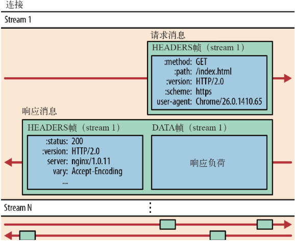
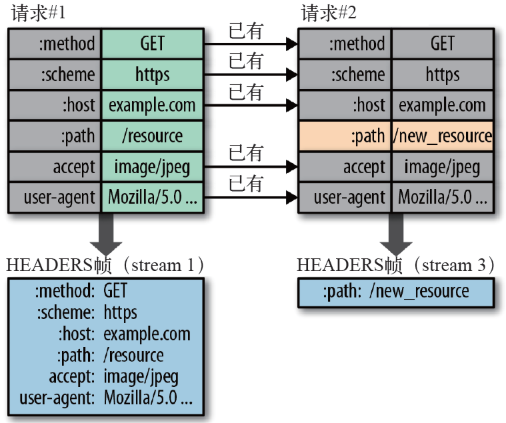

Http2.0
--

# 特点

- 二进制分帧,数据使用二进制传输，相比于文本传输，更利于解析和优化。

    - 流：流是连接中的一个虚拟信道，可以承载双向的消息；每个流都有一个唯一的整数标识符（1、2…N）；

    - 消息：是指逻辑上的 HTTP 消息，比如请求、响应等，由一或多个帧组成。

    - 帧：HTTP 2.0 通信的最小单位，每个帧包含帧首部，至少也会标识出当前帧所属的流，承载着特定类型的数据，如 HTTP 首部、负荷，等等

- 多路复用。

    - 同域名下所有通信都在单个连接上完成。

    - 单个连接可以承载任意数量的双向数据流。

    - 数据流以消息的形式发送，而消息又由一个或多个帧组成，多个帧之间可以乱序发送，因为根据帧首部的流标识可以重新组装。

    - 在 HTTP/2 中，每个请求都可以带一个 31bit 的优先值，0 表示最高优先级， 数值越大优先级越低。有了这个优先值，客户端和服务器就可以在处理不同的流时采取不同的策略，以最优的方式发送流、消息和帧。

- 首部压缩

    - HTTP/2 在客户端和服务器端使用“首部表”来跟踪和存储之前发送的键－值对，对于相同的数据，不再通过每次请求和响应发送；

    - 首部表在 HTTP/2 的连接存续期内始终存在，由客户端和服务器共同渐进地更新;

    - 每个新的首部键－值对要么被追加到当前表的末尾，要么替换表中之前的值

--

# Server Push 
即服务端能通过 push 的方式将客户端需要的内容预先推送过去，也叫“cache push”。可以想象以下情况，某些资源客户端是一定会请求的，这时就可以采取服务端 push 的技术，提前给客户端推送必要的资源，这样就可以相对减少一点延迟时间。当然在浏览器兼容的情况下你也可以使用 prefetch。例如服务端可以主动把 JS 和 CSS 文件推送给客户端，而不需要客户端解析 HTML 时再发送这些请求。

--

# TLS False Start，
这是Google提出来的优化方案，具体做法是：在TLS握手协商的第二个阶段，也就是客户端在验证证书，发送了pre—master secret之后，就直接把应用数据带上，比如请求网页数据。然后服务器端收到pre—master secret后，生成对称密钥，然后直接用对称密钥解密这个应用数据，并响应消息给客户端。其实就是把两个步骤混合为一个步骤了，客户端不需要等待服务器确认，再发送应用数据，而是直接在第二阶段就和pre—master secret一起发送给服务器端，减少了握手过程，从而减少了耗时。

--

# OCSP Stapling，
OCSP是一种验证检查证书吊销状态（合法性）的在线查询服务。验证证书的过程中有一步是验证证书的合法性，我们可以让服务器先通过OCSP查询证书是否合法，然后把这个结果和证书一起发送给客户端，客户端就不需要单独验证证书的合法性了，从而提高了TLS握手效率。这个功能就叫做OCSP Stapling。

--

# HTTP/2 使用了多路复用，
一般来说同一域名下只需要使用一个 TCP 连接。但当这个连接中出现了丢包的情况，那就会导致 HTTP/2 的表现情况反倒不如 HTTP/1 了。因为在出现丢包的情况下，整个 TCP 都要开始等待重传，也就导致了后面的所有数据都被阻塞了。但是对于 HTTP/1.1 来说，可以开启多个 TCP 连接，出现这种情况反到只会影响其中一个连接，剩余的 TCP 连接还可以正常传输数据。那么可能就会有人考虑到去修改 TCP 协议，其实这已经是一件不可能完成的任务了。因为 TCP 存在的时间实在太长，已经充斥在各种设备中，并且这个协议是由操作系统实现的，更新起来不大现实。

--

# QUIC 基于 UDP 实现，
是 HTTP/3 中的底层支撑协议，该协议基于 UDP，又取了 TCP 中的精华，实现了即快又可靠的协议

