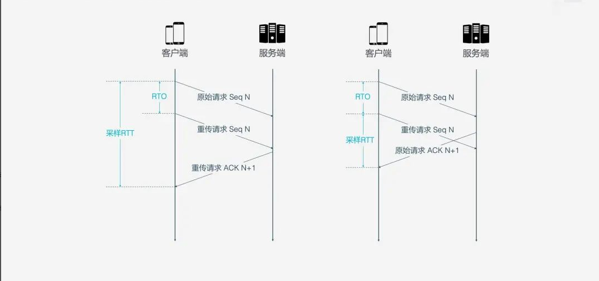

# QUIC
## 特点
由于 QUIC 是基于 UDP 的，所以 QUIC 可以实现 0-RTT 或者 1-RTT 来建立连接，可以大大提升建连速度。
QUIC 具体握手过程如下：

* 客户端判断本地是否已有服务器的全部配置参数（证书配置信息），如果有则直接跳转到(5)，否则继续；
* 客户端向服务器发送 inchoate client hello(CHLO)消息，请求服务器传输配置参数；
* 服务器收到 CHLO，回复 rejection(REJ)消息，其中包含服务器的部分配置参数；
* 客户端收到 REJ，提取并存储服务器配置参数，跳回到(1) ；
* 客户端向服务器发送 full client hello 消息，开始正式握手，消息中包括客户端选择的公开数。此时客户端根据获取的服务器配置参数和自己选择的公开数，可以计算出初始密钥 K1；
* 服务器收到 full client hello，如果不同意连接就回复 REJ，同(3)；如果同意连接，根据客户端的公开数计算出初始密钥 K1，回复 server hello(SHLO)消息，SHLO 用初始密钥 K1 加密，并且其中包含服务器选择的一个临时公开数；
* 客户端收到服务器的回复，如果是 REJ 则情况同(4)；如果是 SHLO，则尝试用初始密钥 K1 解密，提取出临时公开数；
* 客户端和服务器根据临时公开数和初始密钥 K1，各自基于 SHA-256 算法推导出会话密钥 K2；
双方更换为使用会话密钥 K2 通信，初始密钥 K1 此时已无用，QUIC 握手过程完毕。之后会话密钥 K2 更新的流程与以上过程类似，只是数据包中的某些字段略有不同。

对比下基于TCP的连接：

## 连接迁移

网络切换几乎无时无刻不在发生。
TCP协议使用五元组来表示一条唯一的连接，当我们从WIFI环境切换到4G环境时，手机的IP地址就会发生变化，这时必须创建新的TCP连接才能继续传输数据。
QUIC协议基于UDP实现摒弃了五元组的概念，使用64位的随机数作为连接的ID，并使用该ID表示连接。
基于QUIC协议之下，我们在日常wifi和4G切换时，或者不同基站之间切换都不会重连，从而提高业务层

## 无队头阻塞的多路复用

QUIC协议是基于UDP协议实现的，在一条链接上可以有多个流，流与流之间是互不影响的，当携带个别流的的数据的包丢失时，通常只影响该流。

Stream 之间相互独立，比如 Stream2 丢了一个 Pakcet，不会影响 Stream3 和 Stream4。不存在 TCP 队头阻塞。

与TCP对比：

## 可自定义的拥塞控制
拥塞控制的目的是避免过多的数据一下子涌入网络，导致网络超出最大负荷。QUIC 的拥塞控制与 TCP 类似，并在此基础上做了改进。

### TCP拥塞控制

TCP 拥塞控制由 4 个核心算法组成：慢启动、拥塞避免、快速重传和快速恢复，理解了这 4 个算法，对 TCP 的拥塞控制也就有了大概了解。

* 慢启动
发送方向接收方发送 1 个单位的数据，收到对方确认后会发送 2 个单位的数据，然后依次是 4 个、8 个……呈指数级增长，这个过程就是在不断试探网络的拥塞程度，超出阈值则会导致网络拥塞；
* 拥塞避免
指数增长不可能是无限的，到达某个限制（慢启动阈值）之后，指数增长变为线性增长；
* 快速重传
发送方每一次发送时都会设置一个超时计时器，超时后即认为丢失，需要重发；
* 快速恢复
在上面快速重传的基础上，发送方重新发送数据时，也会启动一个超时定时器，如果收到确认消息则进入拥塞避免阶段，如果仍然超时，则回到慢启动阶段

### QUIC拥塞控制

* 热插拔
TCP 中如果要修改拥塞控制策略，需要在系统层面进行操作。
QUIC 修改拥塞控制策略只需要在应用层操作, 应用程序不需要停机和升级就能实现拥塞控制的变更，可以针对不同业务，不同网络制式，甚至不同的 RTT，使用不同的拥塞控制算法。

* 单调递增的 Packet Number
TCP 为了保证可靠性，使用 Sequence Number 和 ACK 来确认消息是否有序到达，但这样的设计存在缺陷。
超时发生后客户端发起重传，后来接收到了 ACK 确认消息，但因为原始请求和重传请求接收到的 ACK 消息一样，所以客户端就郁闷了，不知道这个 ACK 对应的是原始请求还是重传请求。如果客户端认为是原始请求的 ACK，但实际上是左图的情形，则计算的采样 RTT 偏大；如果客户端认为是重传请求的 ACK，但实际上是右图的情形，又会导致采样 RTT 偏小
RTO 是指超时重传时间（Retransmission TimeOut）

QUIC 同样是一个可靠的协议，它使用 Packet Number 代替了 TCP 的 Sequence Number，并且每个 Packet Number 都严格递增，也就是说就算 Packet N 丢失了，重传的 Packet N 的 Packet Number 已经不是 N，而是一个比 N 大的值，比如 Packet N+M。

QUIC 使用 Stream ID 来标识当前数据流属于哪个资源请求，这同时也是数据包多路复用传输到接收端后能正常组装的依据。
重传的数据包 Packet N+M 和丢失的数据包 Packet N 单靠 Stream ID 的比对一致仍然不能判断两个数据包内容一致，还需要再新增一个字段 Stream Offset，标识当前数据包在当前 Stream ID 中的字节偏移量。
有了 Stream Offset 字段信息，属于同一个 Stream ID 的数据包也可以乱序传输了，通过两个数据包的 Stream ID 与 Stream Offset 都一致，就说明这两个数据包的内容一致。

* 前向纠错 FEC
QUIC 使用前向纠错(FEC，Forward Error Correction)技术增加协议的容错性。一段数据被切分为 10 个包后，依次对每个包进行异或运算，运算结果会作为 FEC 包与数据包一起被传输，如果不幸在传输过程中有一个数据包丢失，那么就可以根据剩余 9 个包以及 FEC 包推算出丢失的那个包的数据，这样就大大增加了协议的容错性。

* 更多的 Ack 块和增加 Ack Delay 时间
一般来说，接收方收到发送方的消息后都应该发送一个 ACK 回复，表示收到了数据。但每收到一个数据就返回一个 ACK 回复太麻烦，所以一般不会立即回复，而是接收到多个数据后再回复，TCP SACK 最多提供 3 个 ACK block。但有些场景下，比如下载，只需要服务器返回数据就好，但按照 TCP 的设计，每收到 3 个数据包就要“礼貌性”地返回一个 ACK。而 QUIC 最多可以捎带 256 个 ACK block。在丢包率比较严重的网络下，更多的 ACK block 可以减少重传量，提升网络效率。

TCP 计算 RTT 时没有考虑接收方接收到数据到发送确认消息之间的延迟，如下图所示，这段延迟即 ACK Delay。QUIC 考虑了这段延迟，使得 RTT 的计算更加准确。

## 流量控制
TCP 会对每个 TCP 连接进行流量控制，流量控制的意思是让发送方不要发送太快，要让接收方来得及接收，不然会导致数据溢出而丢失，TCP 的流量控制主要通过滑动窗口来实现的。拥塞控制主要是控制发送方的发送策略，但没有考虑到接收方的接收能力，流量控制是对这部分能力的补齐。

QUIC 的流量控制  类似 HTTP2，即在 Connection 和 Stream 级别提供了两种流量控制，即基于 stream 和 connecton 级别的流量控制
### Stream 级别流量控制
Stream 还没传输数据时，接收窗口（flow control receive window）就是最大接收窗口（flow control receive window）

随着接收方接收到数据后，接收窗口不断缩小。在接收到的数据中，有的数据已被处理，而有的数据还没来得及被处理。如下图所示，绿色块表示已处理数据，橙色色块表示未处理数据（间隙可能是丢包导致的数据没有到达），这部分数据的到来，使得 Stream 的接收窗口缩小

每当新的数据到来的时候，接收端一直更新记录接收数据的最大偏移，来更新流量接收窗口。同时取出数据的时候，也更新记录以及消耗数据的长度，如果消耗数据的长度大于了最大接收窗口的一半，如图的时候，

               bool send_update =  (flow control receive offset - consumed bytes) < (max receive window / 2);

最大接收窗口向右移动当前消耗的字节，移动后的效果如图.同时给对端发送更新帧，内容就是当前最大接收偏移的值offset。

connecton级别流量控制
流级别的流量控制虽然能起到控制流量的效果，但是不够充分，数据发送端可以在同一个链接创建多条流来发送数据，每条流都达到最大值的攻击方法。因此还需要链接级别的流量控制。