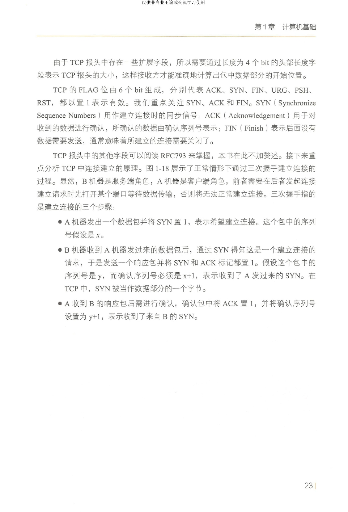
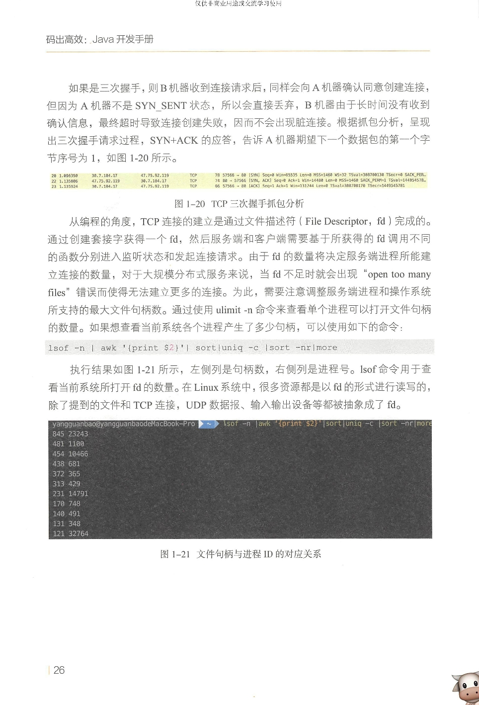
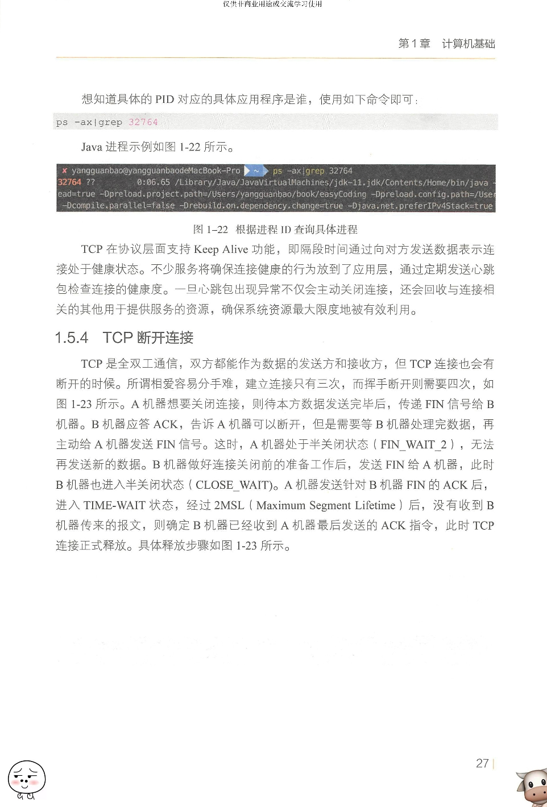
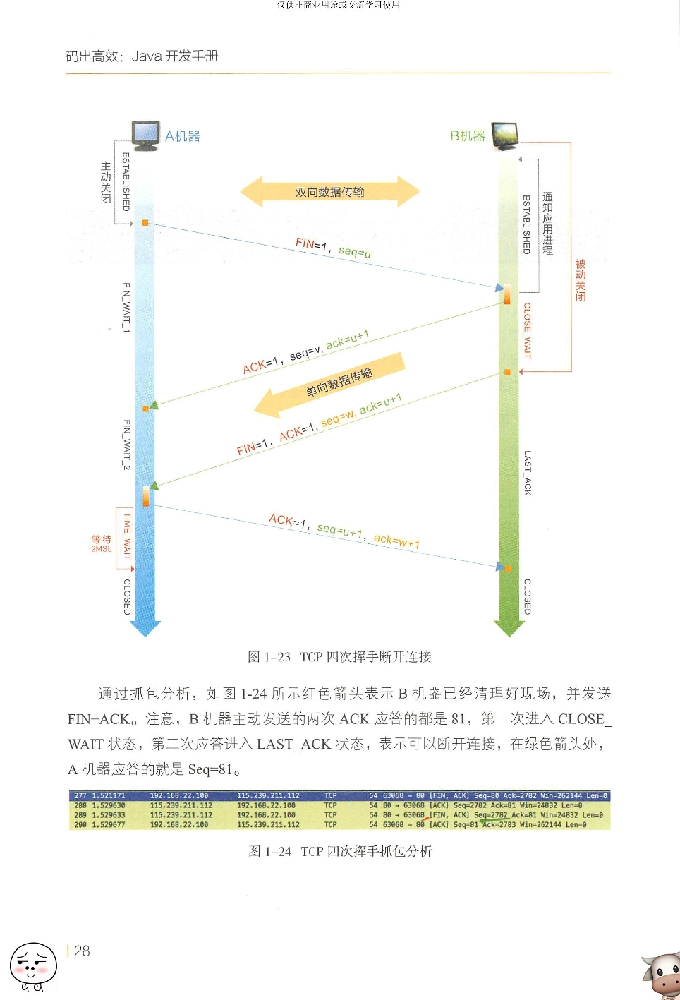

# TCP
TCP
--

# 特点
是数据准确、顺序不能错、要求稳定可靠,全双工

--

# 状态

- 三次握手

    - TCP头部有几个重要信息：SYN、ACK、Seq、Ack。

    - SYN，同步序列编号，是TCP/IP建立连接时使用的握手信号，如果这个值为1就代表是连接消息。ACK，确认标志，如果这个值为1就代表是确认消息。Seq，数据包序号，是发送数据的一个顺序编号。Ack Number，确认数字号，是接收数据的一个顺序编号。

    - 所以客户端就生成了这样一个数据包，其中头部信息的控制位SYN设置为1，代表连接。SEQ设置一个随机数，代表初始序号，比如100。然后服务器端收到这个消息，知道了客户端是要来连接的（SYN=1），知道了传输数据的初始序号（SEQ=100）。

    - 服务器端也要生成一个数据包发送给客户端，这个数据包的TCP头部会包含：表示我也要连接你的SYN（SYN=1），我已经收到了你的上个数据包的确认号ACK=1（Ack=Seq+1=101），以及服务器端随机生成的一个序号Seq（比如Seq=200）。

    - 最后客户端收到这个消息后，表示客户端到服务器的连接是无误了，然后再发送一个数据包表示也确认收到了服务器发来的数据包，这个数据包的头部就主要就是一个ACK=1（Ack=Seq+1=201）。

    - 客户端可以在发送ACK分组之后立即发送数据，而服务器必须等到接收到ACK分组之后才能发送数据

- 数据传输阶段

    - 数据传输阶段有个改变就是Ack确认号不再是Seq+1了，而是Seq+数据长度。例如：

         - A发送给B的数据包（Seq=100，长度=1000字节）

         - B回给A的数据包（Ack=100+1000=1100）

    - 这就是一次数据传输的头部信息，Ack代表下个数据包应该从哪个字节开始所以等于上个数据包的Seq+长度，Seq就等于上个数据包的Ack。

    - 当然，TCP通信是双向的，所以实际数据每个消息都会有Seq和Ack：

         - A发送给B的数据包（Ack=200，Seq=100，长度=1000字节）

         - B回给A的数据包（Ack=100+1000=1100，Seq=上一个数据包的Ack=200，长度=500字节）

         - A发送给B数据包（Seq=1100，Ack=200+500=700）

- 断开阶段，和连接阶段一样，TCP头部也有一个专门用作关闭连接的值叫做FIN。

    - 客户端准备关闭连接，会发送一个TCP数据包，头部信息中包括（FIN=1代表要断开连接）。

    - 服务器端收到消息，回复一个数据包给客户端，头部信息中包括Ack确认号。但是此时服务器端的正常业务可能没有完成，还要处理下数据，收个尾。

    - 客户端收到消息。

    - 服务器继续处理数据。

    - 服务器处理数据完毕，准备关闭连接，会发送一个TCP数据包给客户端，头部信息中包括（FIN=1代表要断开连接）。

    - 客户端端收到消息，进入TIME_WAIT状态，回复一个数据包给服务器端，头部信息中包括Ack确认号。

         - 什么要有TIME_WAIT这个状态？假设最终的ACK丢失，主机2将重发FIN，主机1必须维护TCP状态信息以便可以重发最终的ACK，否则会发送RST，结果主机2认为发生错误。TCP实现必须可靠地终止连接的两个方向(全双工关闭)，主机1必须进入 TIME_WAIT 状态，因为主机1可能面 临重发最终ACK的情形。

    - 服务器收到消息，到此服务器端完成连接关闭工作。

    - 客户端经过一段时间（2MSL），自动进入关闭状态，到此客户端完成连接关闭工作。

         - 客户端并不知道B是否接到自己的ACK，客户端是这么想的：

         - 1）如果服务器没有收到自己的ACK，会超时重传FiN那么A再次接到重传的FIN，会再次发送ACK

         - 2）如果服务器收到自己的ACK，也不会再发任何消息，包括ACK

         - 无论是1还是2，A都需要等待，要取这两种情况等待时间的最大值，以应对最坏的情况发生，这个最坏情况是：

         - 去向ACK消息最大存活时间（MSL) + 来向FIN消息的最大存活时间(MSL)。

         - 这恰恰就是2MSL( Maximum Segment Life)。

    - 这里有个问题是关于为什么需要四次挥手？

         - A发送断开消息给B，B回一条消息表示我收到了，这个过程就保证了A断开成功。B发送断开消息给A，A回一条消息表示我收到了，这个过程就保证了B断开成功。

         - 其实和连接阶段的区别就在于，这里的B的确认消息和断开消息不能融合。因为A要断开的时候，B可能还有数据要处理要发送，所以要等正常业务处理完，在发送断开消息

--

# 滑动窗口，
接收端会告知发送方的自己的接收窗口（rwnd），TCP 在收到数据包回复的 ACK 包里会带上自己接收窗口的大小，发送方需要根据这个值调整自己的发送策略。

- TCP Window Full 是站在发送端角度说的，表示在途字节数等于对方接收窗口的情况，此时发送端不能再发数据给对方直到发送的数据包得到 ACK。

- TCP zero window 是站着接收端角度来说的，是接收端接收窗口满，告知对方不能在发送数据给自己。

--

# 拥塞预防控制

- 拥塞窗口（cwnd），拥塞窗口（cwnd）是发送端的限制，是发送端在还未收到对端 ACK 之前还能发送的数据量大小。

- 慢启动阈值。

    - 服务器可以向客户端发送4个TCP段，然后就必须停下来等待确认。此后，每收到一个ACK，慢移动算法就会告诉服务器可以将它的cwnd值增加1个TCP段

    - 把服务器的初始cwnd值增加到新规定的10段

- 拥塞预防，cwnd 每经过一个 RTT，就会变为之前的两倍。但是也不可能无止境的指数级增长下去，否则就失控了，当 cwnd 超过慢启动阈值时，就启动拥塞避免算法，拥塞窗口按线性增长。即每经过一个 RTT，cwnd 增加 1.

- 快速重传，当接收端收到一个不按序到达的数据段时，TCP 立刻发送一个 1 个重复 ACK，当发送端收到 3 个或以上重复 ACK 时，就意识到之前发的包可能丢了，于是马上进行重传，不用傻等到重传定时器超时在重传。

--

# 带宽延迟积，
拥塞窗口cwnd,接收窗口rwnd

--

# 队首阻塞，
每个TCP分组都会带着一个唯一的序列号发出，而所有的分组必须按顺序传送到接收端，如果中途有个分组没能达到接收端。这一切都发生在TCP层，应用对TCP重发和缓冲区中排队的分组一无所知，必须等到分组全部到达后才能访问树。这种效应被称为TCP队首阻塞

--

# 优化建议

- 服务器调优

    - 增加TCP的初始拥塞窗口

    - 慢启动重启

    - 窗口缩放--增大最大接收窗口的大小。

- 应用程序调优

    - 能少发就少发

    - 重用TCP连接

