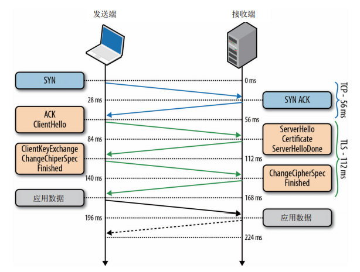
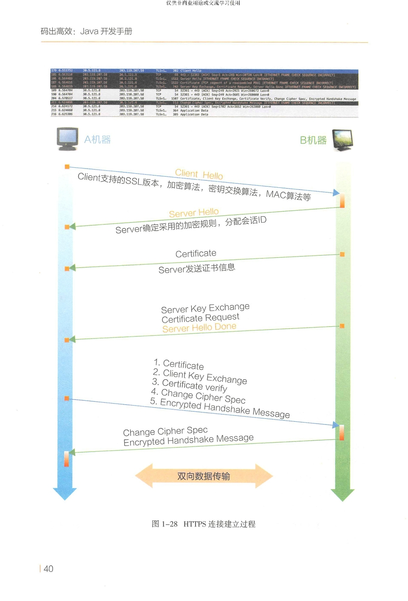
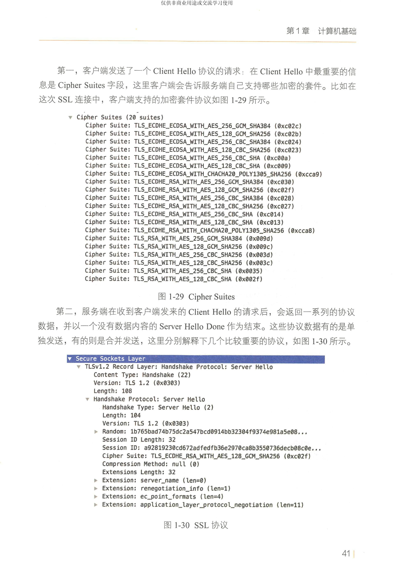
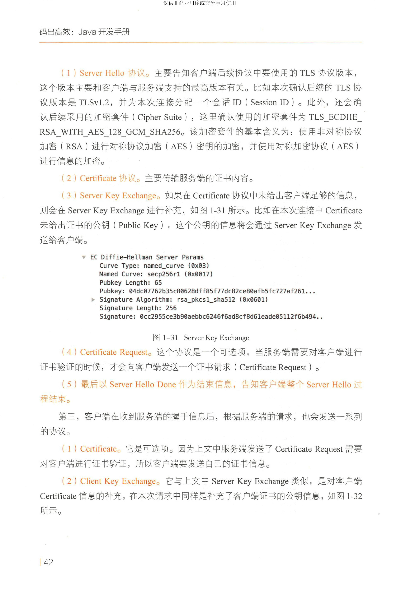
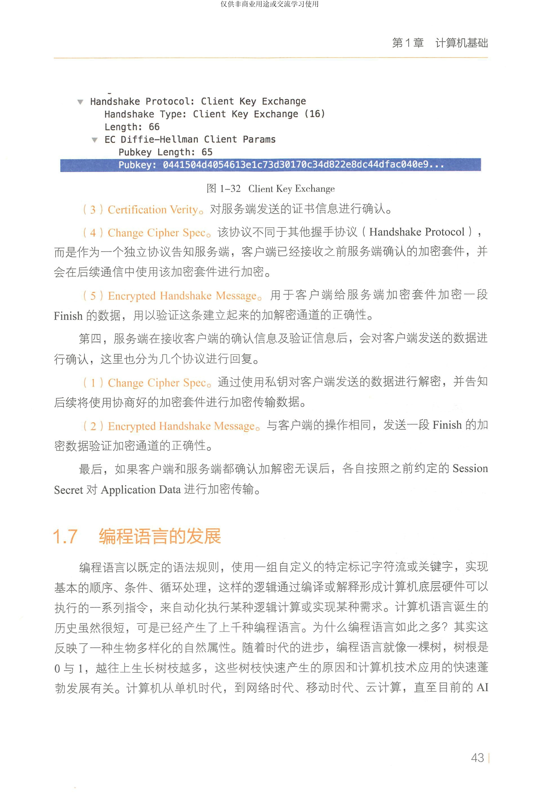

TLS
--

# TLS 协议的目标
是为在它之上运行的应用提供三个基本服务：加密、身份验证和数据完整性。

--

# TLS 协议
还提供了自己的消息分帧机制，使用 MAC（消息认证码）签署每一条消息。MAC 算法是一个单向加密的散列函数（本质上是一个校验和），密钥由连接双方协商确定。只要发送 TLS 记录，就会生成一个 MAC 值并附加到该消息中。接收端通过计算和验证这个 MAC 值来判断消息的完整性和可靠性。

--

# TLS握手，
客户端与服务器在通过 TLS 交换数据之前，必须协商建立加密信道。协商内容包括 TLS 版本、加密套件，必要时还会验证证书。

- 假设两端经过协商确定了共同的版本和加密套件，客户端也高高兴兴的把自己的证书提供给了服务器。然后，客户端会生成一个新的对称密钥，用服务器的公钥来加密，加密后发送给服务器，告诉服务器可以开始加密通信了。到目前为止，除了用服务器公钥加密的新对称密钥之外，所有数据都以明文形式发送。

- 服务器解密出客户端发来的对称密钥，通过验证消息的 MAC 检测消息完整性，再返回给客户端一个加密的 “Finished” 消息。

- 客户端用它之前生成的对称密钥解密这条消息，验证 MAC，如果一切顺利，则建立信道并开始发送应用数据。

--

# TLS回话恢复，
完整 TLS 握手会带来额外的延迟和计算量，从而给所有依赖安全通信的应用造成严重的性能损失。为了挽回某些损失，TLS 提供了恢复功能，即在多个连接间共享协商后的安全密钥。

- 会话标识符

    - 会话标识符最早的 “会话标识符” 机制是在 SSL 2.0 中引入的，支持服务器创建 32 字节的会话标识符，并在上一节我们讨论的完整的 TLS 协商期间作为其 “ServerHello” 消息的一部分发送。

    - 在内部，服务器会为每个客户端保存一个会话 ID 和协商后的会话参数。相应地，客户端也可以保存会话 ID 信息，并将该 ID 包含在后续会话的 “ClientHello” 消息中，从而告诉服务器自己还记着上次握手协商后的加密套件和密钥呢，这些都可以重用。假设客户端和服务器都可以在自己的缓存中找到共享的会话 ID 参数，那么就可以进行简短握手。否则，就要重新启动一次全新的会话协商，生成新的会话 ID。

- 会话记录单

    - 该机制不用服务器保存每个客户端的会话状态。相反，如果客户端表明其支持会话记录单，则服务器可以在完整 TLS 握手的最后一次交换中添加一条 “新会话记录单” 记录，包含只有服务器知道的安全密钥加密过的所有回话数据。

    - 然后，客户端将这个会话记录单保存起来，在后续会话的 ClientHello 消息中，可以将其包含在 SessionTicket 扩展中。这样，所有会话数据只保存在客户端，而由于数据被加密过，且密钥只有服务器知道，因此仍然是安全的。

