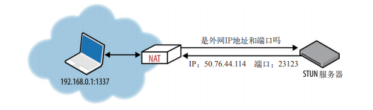
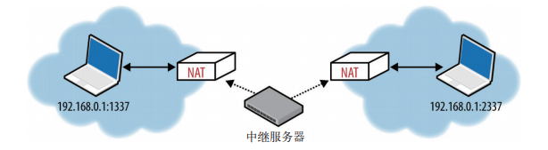
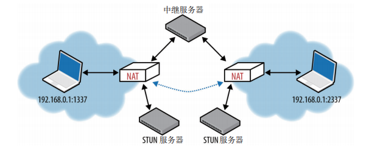

UDP
--

# UDP 
仅仅是在 IP 层之上通过嵌入应用程序的源端口和目标端口

--

# 网络地址转换器NAT

- NAT 设备还被赋予了删除转换记录的责任，但由于 UDP 没有连接终止确认环节，任何一端随时都可以停止传输数据报，而不必发送通告。为解决这个问题，UDP 路由记录会定时过期。定时多长？没有规定，完全取决于转换器的制造商、型号、版本和配置。

- 穿透

    - STUN 服务器的 IP 地址已知（通过 DNS 查找或手工指定），应用程序首先向 STUN 服务器发送一个绑定请求。然后，STUN 服务器返回一个响应，其中包含在外网中代表客户端的 IP 地址和端口号。

    - 两端都要向同一台 TURN 服务器发送分配请求未建立连接，然后在进行权限协商，协商完毕，两端都把数据发送到 TURN 服务器，再有 TURN 服务器转发，从而实现通信

    - ICE 规定了一套方法，致力于在通信各端之间建立一条最有效的通信：能直连就直连，必要时 STUN 协商，再不行使用 TURN。ICE 先后尝试直连、STUN 和 TURN

--

# 优化建议

- 应用程序必须容忍各种因特网路径条件

- 应用程序应该控制传输速度

- 应用程序应该对所有流量进行拥塞控制

- 应用程序应该使用与 TCP 相近的带宽

- 应用程序应该准备基于丢包的重发计数器

- 应用程序应该不发送大于路径 MTU 的数据报

- 应用程序应该处理数据报丢失、重复和重排

- 应用程序应该足够稳定以支持两分钟以上的交付延迟

- 应用程序应该支持 IPv4 UDP 校验和，必须支持 IPv6 校验和

- 应用程序可以在需要时使用 keep-alive（最小间隔 15 秒）

