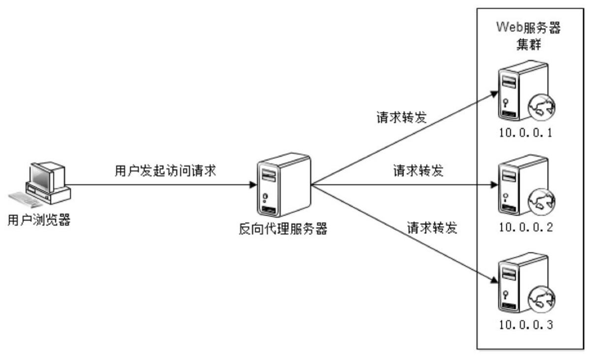
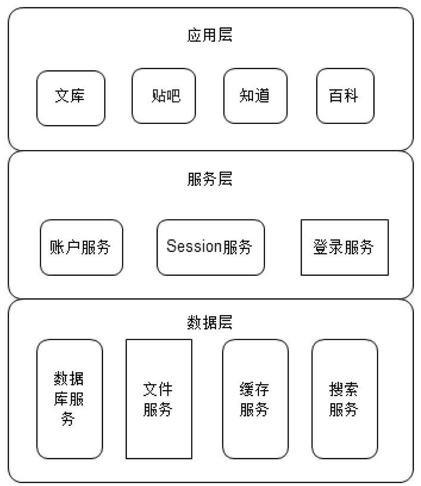
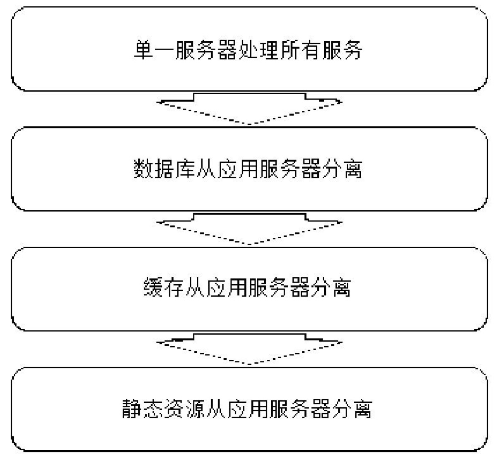
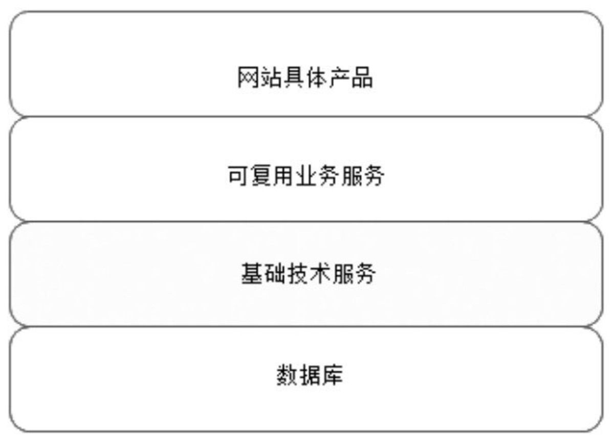
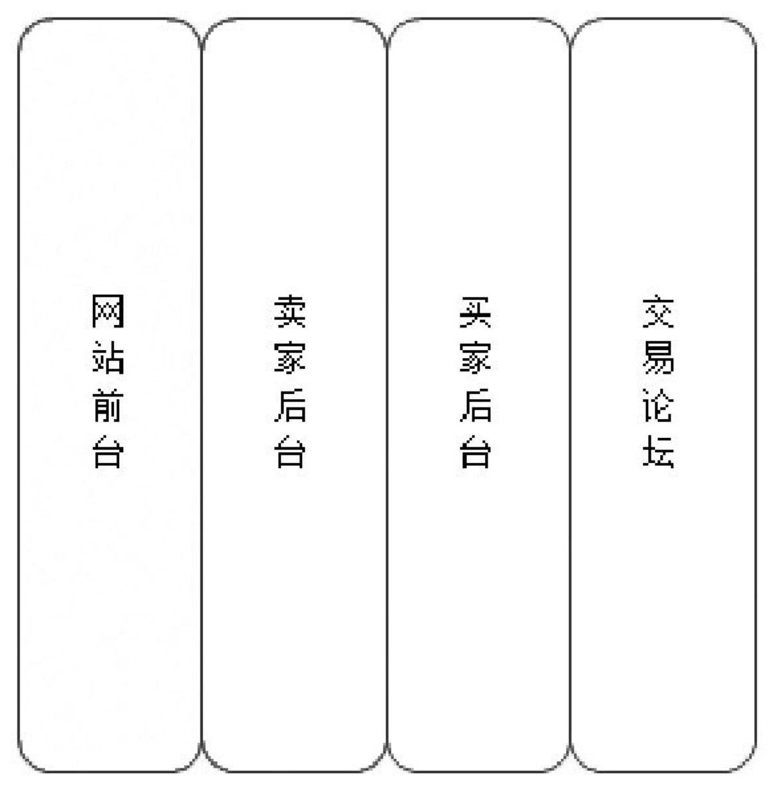

大型网站技术架构
--

# 1.4 网站架构设计误区，
技术是用来解决业务问题的，而业务的问题，也可以通过业务的手段去解决。

--

# 架构：
每一个模式描述了一个在我们周围不断重复发生的问题及该问题解决方案的核心。这样，你就能一次又一次地使用该方案而不必做重复工作

--

# 2.1 网站架构模式

- 分层架构也有一些挑战，就是必须合理规划层次边界和接口，在开发过程中，严格遵循分层架构的约束，禁止跨层次的调用（应用层直接调用数据层）及逆向调用（数据层调用服务层，或者服务层调用应用层）。

- 如果说分层是将软件在横向方面进行切分，那么分割就是在纵向方面对软件进行切分，将这些不同的功能和服务分割开来，包装成高内聚低耦合的模块单元，一方面有助于软件的开发和维护；另一方面，便于不同模块的分布式部署，提高网站的并发处理能力和功能扩展能力。

- 分布式，分层和分割的一个主要目的是为了切分后的模块便于分布式部署，即将不同模块部署在不同的服务器上，通过远程调用协同工作。分布式意味着可以使用更多的计算机完成同样的功能，计算机越多，CPU、内存、存储资源也就越多，能够处理的并发访问和数据量就越大，进而能够为更多的用户提供服务。

    - 分布式应用和服务

    - 分布式静态资源

    - 分布式数据和存储

    - 分布式计算

- 集群，多台服务器部署相同应用构成一个集群

- 缓存

    - 反向代理：反向代理属于网站前端架构的一部分，部署在网站的前端，当用户请求到达网站的数据中心时，最先访问到的就是反向代理服务器，这里缓存网站的静态资源，无需将请求继续转发给应用服务器就能返回给用户。

- 在分布式系统中，多个服务器集群通过分布式消息队列实现异步，分布式消息队列可以看作内存队列的分布式部署。

--

# 3 大型网站核心架构要素

- 关于什么是架构，一种比较通俗的说法是“最高层次的规划，难以改变的决定”，这些规划和决定奠定了事物未来发展的方向和最终的蓝图。

- 性能

    - 响应时间

    - 并发数

    - 吞吐量

- 3.2 可用性

    - 因此网站高可用架构设计的前提是必然会出现服务器宕机，而高可用设计的目标就是当服务器宕机的时候，服务或者应用依然可用。网站高可用的主要手段是冗余，应用部署在多台服务器上同时提供访问，数据存储在多台服务器上互相备份，任何一台服务器宕机都不会影响应用的整体可用，也不会导致数据丢失

- 3.3 伸缩性

    - 所谓伸缩性是指通过不断向集群中加入服务器的手段来缓解不断上升的用户并发访问压力和不断增长的数据存储需求。

    - 衡量架构伸缩性的主要标准就是是否可以用多台服务器构建集群，是否容易向集群中添加新的服务器。加入新的服务器后是否可以提供和原来的服务器无差别的服务。集群中可容纳的总的服务器数量是否有限制。

- 扩展

- 安全

--

# 4.2 Web前端性能优化

- 浏览器访问优化

    - 减少http请求，减少HTTP的主要手段是合并CSS、合并JavaScript、合并图片。将浏览器一次访问需要的JavaScript、CSS合并成一个文件，这样浏览器就只需要一次请求。

    - 使用浏览器缓存

    - 启用压缩

    - css放在上面，js放在下面

    - 减少Cookie传输太大的Cookie会严重影响数据传输，因此哪些数据需要写入Cookie需要慎重考虑，尽量减少Cookie中传输的数据量。

- CDN加速

- 和传统代理服务器可以保护浏览器安全一样，反向代理服务器也具有保护网站安全的作用，来自互联网的访问请求必须经过代理服务器，相当于在Web服务器和可能的网络攻击之间建立了一个屏障。

--

# 4.3 应用服务器性能优化

- 网站性能优化第一定律：优先考虑使用缓存优化性能。

- 网站数据访问通常遵循二八定律，即80%的访问落在20%的数据上

- 通过分布式缓存服务器集群，将缓存数据分布到集群多台服务器上可在一定程度上改善缓存的可用性。当一台缓存服务器宕机的时候，只有部分缓存数据丢失，重新从数据库加载这部分数据不会对数据库产生很大影响。

- Memcached采用一种集中式的缓存集群管理，也被称作互不通信的分布式架构方式。缓存与应用分离部署，缓存系统部署在一组专门的服务器上，应用程序通过一致性Hash等路由算法选择缓存服务器远程访问缓存数据，缓存服务器之间不通信，缓存集群的规模可以很容易地实现扩容，具有良好的可伸缩性。

- Hash表的读写性能在很大程度上依赖HashCode的随机性，即HashCode越随机散列，Hash表的冲突就越少，读写性能也就越高，目前比较好的字符串Hash散列算法有Time33算法，即对字符串逐字符迭代乘以33，求得Hash值，算法原型为：hash(i) = hash(i-1) * 33 + str[i]

--

# 5.2 高可用的网站架构

- 实现上述高可用架构的主要手段是数据和服务的冗余备份及失效转移，一旦某些服务器宕机，就将服务切换到其他可用的服务器上，如果磁盘损坏，则从备份的磁盘读取数据。

- 位于应用层的服务器通常为了应对高并发的访问请求，会通过负载均衡设备将一组服务器组成一个集群共同对外提供服务，当负载均衡设备通过心跳检测等手段监控到某台应用服务器不可用时，就将其从集群列表中剔除，并将请求分发到集群中其他可用的服务器上，使整个集群保持可用，从而实现应用高可用。

- 服务器被应用层通过分布式服务调用框架访问，分布式服务调用框架会在应用层客户端程序中实现软件负载均衡，并通过服务注册中心对提供服务的服务器进行心跳检测，发现有服务不可用，立即通知客户端程序修改服务访问列表，剔除不可用的服务器。

- 数据写入时进行数据同步复制，将数据写入多台服务器上，实现数据冗余备份。当数据服务器宕机时，应用程序将访问切换到有备份数据的服务器上。

- 5.3 高可用的应用

    - 所谓无状态的应用是指应用服务器不保存业务的上下文信息，而仅根据每次请求提交的数据进行相应的业务逻辑处理，多个服务实例（服务器）之间完全对等，请求提交到任意服务器，处理结果都是完全一样的。

    - 这种解决方案事实上是将应用服务器的状态分离，分为无状态的应用服务器和有状态的Session服务器，然后针对这两种服务器的不同特性分别设计其架构。

- 5.5 高可用的数据

    - 保证数据存储高可用的手段主要是数据备份和失效转移机制。

    - 数据持久性

    - 数据可访问性

    - 数据一致性

    - CAP原理认为，一个提供数据服务的存储系统无法同时满足数据一致性（Consistency）、数据可用性（Availibility）、分区耐受性（Patition Tolerance，系统具有跨网络分区的伸缩性）这三个条件

    - 实践中，通常使用读写分离的方法访问Slave和Master数据库，写操作只访问Master数据库，读操作只访问Slave数据库。

    - 失效转移操作由三部分组成：失效确认、访问转移、数据恢复。

- 5.6 高可用网站的软件质量保证

    - 预发布服务器是一种特殊用途的服务器，它和线上的正式服务器唯一的不同就是没有配置在负载均衡服务器上

    - 大型网站会使用灰度发布模式，将集群服务器分成若干部分，每天只发布一部分服务器，观察运行稳定没有故障，第二天继续发布一部分服务器，持续几天才把整个集群全部发布完毕，期间如果发现问题，只需要回滚已发布的一部分服务器即可。

--

# 6.1网站架构的伸缩性设计

- 物理分离

- 纵向分离

- 横向分离

- 6.2 应用服务器集群的伸缩性设计

    - HTTP重定向服务器是一台普通的应用服务器，其唯一的功能就是根据用户的HTTP请求计算一台真实的Web服务器地址，并将该Web服务器地址写入HTTP重定向响应中（响应状态码302）返回给用户浏览器。缺点是浏览器需要两次请求服务器才能完成一次访问，性能较差；重定向服务器自身的处理能力有可能成为瓶颈，整个集群的伸缩性规模有限；使用HTTP302响应码重定向，有可能使搜索引擎判断为SEO作弊，降低搜索排名。因此实践中使用这种方案进行负载均衡的案例并不多见。

    - DNS域名解析负载均衡的优点是将负载均衡的工作转交给DNS，省掉了网站管理维护负载均衡服务器的麻烦，同时许多DNS还支持基于地理位置的域名解析，即会将域名解析成距离用户地理最近的一个服务器地址，这样可加快用户访问速度，改善性能。但是DNS域名解析负载均衡也有缺点，就是目前的DNS是多级解析，每一级DNS都可能缓存A记录，当下线某台服务器后，即使修改了DNS的A记录，要使其生效也需要较长时间，这段时间，DNS依然会将域名解析到已经下线的服务器，导致用户访问失败；而且DNS负载均衡的控制权在域名服务商那里，网站无法对其做更多改善和更强大的管理。

    - 大多数反向代理服务器同时提供负载均衡的功能，管理一组Web服务器，将请求根据负载均衡算法转发到不同Web服务器上。

    - 数据链路层，负载均衡服务器在操作系统内核进程获取网络数据包，根据负载均衡算法计算得到一台真实Web服务器10.0.0.1，然后将数据目的IP地址修改为10.0.0.1，不需要通过用户进程处理。真实Web应用服务器处理完成后，响应数据包回到负载均衡服务器，负载均衡服务器再将数据包源地址修改为自身的IP地址（114.100.80.10）发送给用户浏览器。这里的关键在于真实物理Web服务器响应数据包如何返回给负载均衡服务器。一种方案是负载均衡服务器在修改目的IP地址的同时修改源地址，将数据包源地址设为自身IP，即源地址转换（SNAT），这样Web服务器的响应会再回到负载均衡服务器；另一种方案是将负载均衡服务器同时作为真实物理服务器集群的网关服务器，这样所有响应数据都会到达负载均衡服务器。

    - 这种数据传输方式又称作三角传输模式，负载均衡数据分发过程中不修改IP地址，只修改目的mac地址，通过配置真实物理服务器集群所有机器虚拟IP和负载均衡服务器IP地址一致，从而达到不修改数据包的源地址和目的地址就可以进行数据分发的目的，由于实际处理请求的真实物理服务器IP和数据请求目的IP一致，不需要通过负载均衡服务器进行地址转换，可将响应数据包直接返回给用户浏览器，避免负载均衡服务器网卡带宽成为瓶颈。这种负载均衡方式又称作直接路由方式（DR）。

- 6.3 分布式缓存集群的伸缩性设计

    - 一致性Hash算法通过一个叫作一致性Hash环的数据结构实现KEY到缓存服务器的Hash映射，如图6.11所示。图6.11 一致性Hash算法原理具体算法过程为：先构造一个长度为0~232的整数环（这个环被称作一致性Hash环），根据节点名称的Hash值（其分布范围同样为0~232）将缓存服务器节点放置在这个Hash环上。然后根据需要缓存的数据的KEY值计算得到其Hash值（其分布范围也同样为0~232），然后在Hash环上顺时针查找距离这个KEY的Hash值最近的缓存服务器节点，完成KEY到服务器的Hash映射查找。

- 6.4 数据存储服务器集群的伸缩性设计

    - 一般而言，NoSQL数据库产品都放弃了关系数据库的两大重要基础：以关系代数为基础的结构化查询语言（SQL）和事务一致性保证（ACID）。而强化其他一些大型网站更关注的特性：高可用性和可伸缩性。

--

# 7 随需应变：网站的可扩展架构

- 扩展性（Extensibility）指对现有系统影响最小的情况下，系统功能可持续扩展或提升的能力。

- 伸缩性（Scalability）指系统能够通过增加（减少）自身资源规模的方式增强（减少）自己计算处理事务的能力。

- 7.1 构建可扩展的网站架构

    - 笔者认为，软件架构师最大的价值不在于掌握多少先进的技术，而在于具有将一个大系统切分成N个低耦合的子模块的能力，这些子模块包含横向的业务模块，也包含纵向的基础技术模块。这种能力一部分源自专业的技术和经验，还有一部分源自架构师对业务场景的理解、对人性的把握、甚至对世界的认知。

--

# 11.1 分布式存储系统的高可用架构

- 对一个大规模集群的存储系统而言，服务器宕机、交换机失效是常态，架构师必须为这些故障发生时，保证系统依然可用而进行系统设计。在系统架构层面，保证高可用的主要手段是冗余：服务器热备，数据多份存储。

