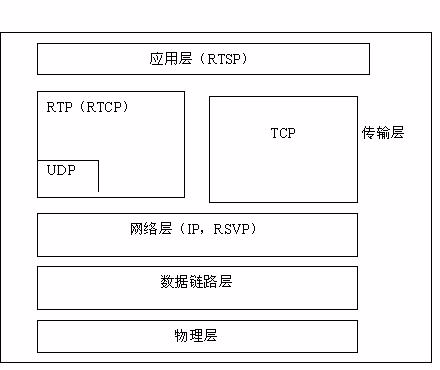

## 基本概念
### 视频
* 静止的画面叫图像（picture）。
* 连续的图像变化每秒超过24帧（frame）画面以上时，根椐视觉暂留原理，人眼无法辨别每付单独的静态画面，看上去是平滑连续的视觉效果。这样的连续画面叫视频。
* 当连续图像变化每秒低于24帧画面时，人眼有不连续的感觉叫动画（cartoon）。

### 流媒体
* 指采用流式传输的方式在Internet/Intranet播放的媒体格式.
* 流媒体的数据流随时传送随时播放，只是在开始时有些延迟。 边下载边播入的流式传输方式不仅使启动延时大幅度地缩短，而且对系统缓存容量的需求也大大降低，极大地减少用户用在等待的时间。

### 分辨率
* 是一个表示平面图像精细程度的概念，通常它是以横向和纵向点的数量来衡量的，表示成水平点数垂直点数的形式。
* 在计算机显示领域我们也表示成“每英寸像素”（ppi）.在一个固定的平面内，分辨率越高，意味着可使用的点数越多，图像越细致。

### 码流
* 数据传输时单位时间传送的数据位数,可以理解其为取样率。
* 单位时间内取样率越大，精度就越高，处理出来的文件就越接近原始文件，但是文件体积与取样率是成正比的。一般我们用的单位是kbps即千位每秒。

### 帧率
* 帧/秒（frames per second）的缩写，也称为帧速率。
* 用于保存、显示动态视频的信息数量。 每一帧都是静止的图象，快速连续地显示帧便形成了运动的假象。每秒钟帧数（fps）愈多，所显示的动作就会愈流畅。

### 多媒体的格式分类
* MPEG : 编码采用的容器，具有流的特性。里面又分为 PS，TS 等，PS 主要用于 DVD 存储，TS 主要用 于 HDTV。
* MPEG Audio Layer 3(Mp3) :能在 128kbps 的码率接近 CD 音质。
* MPEG-4(Mp4) : 编码采用的容器，基于 QuickTime MOV 开发，具有许多先进特性;实际上是对Apple公司开发的MOV格式(也称Quicktime格式)的一种改进。
* MKV: 它能把 Windows Media Video，RealVideo，MPEG-4 等视频音频融为一个文件，而且支持多音轨，支持章节字幕等。
* 3GP : 主要用于流媒体传送;3GP其实是MP4格式的一种简化版本。
* MOV : QuickTime的容器，恐怕也是现今最强大的容器，甚至支持虚拟现实技术，Java等，它的变种 * MP4,3GP都没有这么厉害;广泛应用于Mac OS操作系统，在Windows操作系统上也可兼容。
* AVI : 最常见的音频视频容器,音频视频交错（Audio Video Interleaved）允许视频和音频交错在一起同步播放。
* WAV : 一种音频容器，大家常说的 WAV 就是没有压缩的 PCM 编码，其实 WAV 里面还可以包括 MP3 等其他 ACM 压缩编码。

### 流媒体协议
#### 1.RTP RTCP RTSP
* RTP(Real-time Transport Protocol) 
负责对流媒体数据进行封包并实现媒体流的实时传输，每一个RTP数据报都由头部（Header）和负载（Payload）两个部分组成，其中头部前12个字节的含义是固定的，而负载则可以是音频或者视频数据。
* RTCP(Real-time Transport Control Protocol)
* RTCP控制协议需要与RTP数据协议一起配合使用，当应用程序启动一个RTP会话时将同时占用两个端口，分别供RTP和RTCP使用。RTP本身并 不能为按序传输数据包提供可靠的保证，也不提供流量控制和拥塞控制，这些都由RTCP来负责完成。
* RTSP(Real Time Streaming Protocol)
是一个流媒体表示 协议，主要用来控制具有实时特性的数据发送，但它本身并不传输数据，而是必须依赖于下层传输协议所提供的某些服务。RTSP可以对流媒体提供诸如播放、暂 停、快进等操作，它负责定义具体的控制消息、操作方法、状态码等，此外还描述了与RTP间的交互操作（RFC2326）。
* RTSP和RTP的关系图

 
#### 2.RTMP(Real Time Messaging Protocol)
实时消息传送协议是Adobe Systems公司为Flash播放器和服务器之间音频、视频和数据传输 开发的开放协议。
#### 3.HLS(HTTP Live Streaming)
* 苹果公司(Apple Inc.)实现的基于HTTP的流媒体传输协议，可实现流媒体的直播和点播，主要应用在iOS系统，为iOS设备（如iPhone、iPad）提供音视频直播和点播方案。
* HLS点播，基本上就是常见的分段HTTP点播，不同在于，它的分段非常小。
* 相对于常见的流媒体直播协议，例如RTMP协议、RTSP协议、MMS协议等，HLS直播最大的不同在于，直播客户端获取到的，并不是一个完整的数据流。HLS协议在服务器端将直播数据流存储为连续的、很短时长的媒体文件（MPEG-TS格式），而客户端则不断的下载并播放这些小文件，因为服务器端总是会将最新的直播数据生成新的小文件，这样客户端只要不停的按顺序播放从服务器获取到的文件，就实现了直播。
* 由于数据通过HTTP协议传输，所以完全不用考虑防火墙或者代理的问题，而且分段文件的时长很短，客户端可以很快的选择和切换码率，以适应不同带宽条件下的播放。不过HLS的这种技术特点，决定了它的延迟一般总是会高于普通的流媒体直播协议。
